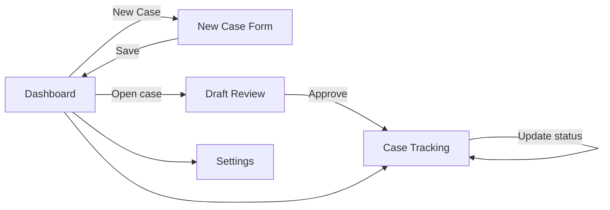

# Development

This document tracks how the app actually gets built, phase by phase — as opposed to `prior-auth-assistant-spec.md`, which describes what the finished product should be. Start here when picking up work; check the spec when a decision needs justifying.

---

## Prototype

**Goal:** the smallest version of the app that has all five screens wired together, a real local database, and click-through navigation — with every "smart" piece (LLM drafting, RAG, RL agent, OCR) stubbed out behind a function boundary so it can be swapped for the real thing later without touching the UI or data layer. This is Phase 0 + Phase 1 of the spec's implementation plan (§8), collapsed into one milestone.

The rule for this stage: **everything the user clicks should do something real** (write to a real local DB, navigate to a real screen, show real saved data back) — but the content of a "draft" can be a hardcoded placeholder string. Simple and working beats partial and clever.

### Scope

**In scope for the prototype:**
- App shell that launches as a desktop window
- Local encrypted-capable SQLite database with a real `cases` table
- Manual case entry (create a case: patient summary text, payer, procedure, specialty)
- Case list / dashboard showing saved cases
- A "draft" screen that shows a canned, hardcoded placeholder letter for any case (no LLM call yet)
- Case status field (draft / submitted / approved / denied) editable by the user
- Basic settings screen with the data export / delete-all buttons wired to real (if simple) file operations

**Explicitly out of scope for the prototype** (stubbed, see below):
- Local LLM drafting engine — return a fixed placeholder string instead
- RAG / policy library retrieval — no real corpus yet, one fake policy doc is fine
- RL / bandit personalization — no strategy selection logic yet
- OCR / document import — manual text entry only
- Deadline countdown logic / reminders — status field exists, deadline math can wait
- Real payer policy corpus — one fake entry is enough to prove the plumbing

### Tech stack for the prototype

| Layer | Choice | Why |
|---|---|---|
| App shell | **Tauri** (Rust core + React/TS frontend) | Matches the long-term stack decision in the spec (§5) — no point prototyping in a throwaway stack you'll rewrite immediately. Electron is the fallback if Rust setup becomes a blocker. |
| UI | React + TypeScript, minimal component library (or plain CSS) | Speed over polish — this UI gets rebuilt/refined once the real screens have real data flowing through them |
| Local storage | SQLite via `tauri-plugin-sql` | Full SQLCipher encryption can come later (§4.7); use plain SQLite now and swap the connection string when encryption is added — don't design around it yet |
| State | Local React state / Zustand | No need for anything heavier at this stage |

### Data model (prototype-minimal)

```sql
CREATE TABLE cases (
    id INTEGER PRIMARY KEY AUTOINCREMENT,
    patient_summary TEXT NOT NULL,
    payer TEXT NOT NULL,
    plan_type TEXT,
    procedure TEXT NOT NULL,
    specialty TEXT,
    status TEXT NOT NULL DEFAULT 'draft',   -- draft | submitted | approved | denied
    draft_text TEXT,                         -- placeholder letter text for now
    created_at TEXT NOT NULL DEFAULT (datetime('now')),
    updated_at TEXT NOT NULL DEFAULT (datetime('now'))
);
```

One table is enough. `outcomes`, `bandit weights`, and `policy_library` tables get added when Phases 5–6 actually need them — adding them now would just be schema for logic that doesn't exist yet.

### Screens (prototype behavior)

1. **Dashboard** — lists all cases from the DB (payer, procedure, status, created date). "New Case" button. No trend charts or approval-rate stats yet — that needs outcome data this prototype doesn't generate.
2. **New Case** — form: patient summary (textarea), payer, plan type, procedure, specialty. Saves a row to `cases` on submit, status defaults to `draft`. Document import button can be present but disabled/"coming soon."
3. **Draft Review** — loads the case, shows a hardcoded placeholder draft letter (e.g., a lorem-ipsum-style template with the case's payer/procedure interpolated in), editable textarea, "Approve" button that sets `status = 'submitted'`. No citations, no RAG — the layout should reserve visual space for citations later so the redesign isn't a rebuild.
4. **Case Tracking** — table of cases with status, sortable/filterable by status. A dropdown/button to change status (submitted → approved/denied) writes back to the DB. This single interaction is what will eventually feed the RL reward signal — get the write path right even though nothing reads it yet.
5. **Settings** — "Export my data" (dump `cases` table to a local JSON/CSV file the user picks a location for) and "Delete all data" (clears the table, with a confirmation step). Skip the network activity log for now — there's no network activity to log until Phase 2's policy sync exists.

Policy Library (screen 6 in the spec) can be a single static page listing one fake payer/procedure entry — enough to prove the nav item and route exist, not enough to be a real feature yet.

### Navigation flow



### Where the stubs live

Put every piece of "smart" logic behind a function with a clear name and a single obvious place to swap in the real implementation later:

- `generateDraft(caseRecord)` → returns a hardcoded string today; becomes the RAG + LLM call in Phase 3
- `selectStrategy(context)` → returns a fixed constant today; becomes the bandit agent in Phase 5
- `retrievePolicy(payer, procedure)` → returns one fake policy object today; becomes real corpus retrieval in Phase 2
- `importDocument(file)` → not called from the UI yet (button disabled); becomes OCR in Phase 7

Naming and isolating these now means the prototype's UI and data layer don't need to change shape when the real logic drops in — only these function bodies do.

### Definition of done

- App launches as a native window via `tauri dev`/build
- A case can be created, appears on the dashboard, and persists across app restart (real SQLite file on disk)
- Draft Review shows a placeholder draft and Approve changes the case's status in the DB
- Case Tracking reflects status changes
- Export produces a real file; Delete-all really clears the table
- No network calls anywhere in this build (there's nothing to sync yet — this also means the CI network-audit test from §8 Phase 0 can be written and pass trivially against this prototype, which is a good early proof that the check itself works)

### After the prototype

Once this skeleton works end-to-end, the next real milestone is Phase 2 from the spec (§8): build one real payer-policy corpus (single payer, single specialty) and wire `retrievePolicy` to it — that's the first stub worth replacing, since the drafting engine and everything downstream depends on it.

---

## Phase 2 — Payer Policy Library (Single Payer, Single Specialty)

**Goal:** replace the `retrievePolicy` stub with retrieval grounded in one payer's *actual* published medical-necessity criteria for one specialty — proving the hardest part of the pipeline (spec §4.2 calls this the highest-effort, highest-value part of the whole project) before expanding to more payers in Phase 6. Everything downstream — the LLM drafting engine (Phase 3), the citation panel already built into Draft Review, the Policy Library screen — depends on this existing for real before it's worth building further.

This phase is deliberately narrow, same lesson as the prototype: one payer, one specialty, prove the full pipeline works before scaling coverage.

### Decision: Aetna, Physical Therapy — resolved

Went with **Aetna's Clinical Policy Bulletin (CPB) Number 0325, "Physical Therapy"** (`https://www.aetna.com/cpb/medical/data/300_399/0325.html`):
- Aetna publishes CPBs as plain HTML, not scanned PDFs — satisfies the clean-text requirement without pulling OCR (Phase 7) forward.
- Physical Therapy is on the spec's clearest-fit specialty list (§1), and lined up with the specialty used in the prototype's own demo case.
- No pilot practice exists yet to defer to, so this was picked on the general criteria above rather than a specific practice's payer mix — worth revisiting once/if a real practice is piloting this.
- **Licensing check:** the page carries a standard Aetna copyright/disclaimer footer ("Copyright Aetna Inc. All rights reserved... Clinical Policy Bulletins are developed by Aetna to assist in administering plan benefits...") but no explicit prohibition on local caching for the kind of provider-reference use this tool is built for. This is *not* the same as a confirmed license to redistribute — before this repo goes public (§11), give Aetna's actual Terms of Use page a real read, not just the on-page disclaimer.

### Design

**Staged approach to retrieval — keyword search first, embeddings later:** it's tempting to reach straight for a vector store (`sqlite-vec`, per the spec's tech stack, §5), but that requires a local embedding model as a new dependency before there's even an LLM in the app to consume the results (LLM drafting is Phase 3). Ship Phase 2 with SQLite FTS5 full-text search over the policy corpus instead — it's already in SQLite, needs no new model, and is enough to prove "does this citation actually match the procedure." Upgrade to real embeddings when Phase 3 wires up the LLM and retrieval quality starts to matter for generation, not just for a citation lookup.

**Local schema** (additive — doesn't touch the `cases` table):

```sql
CREATE TABLE policy_documents (
    id INTEGER PRIMARY KEY AUTOINCREMENT,
    payer TEXT NOT NULL,
    specialty TEXT NOT NULL,
    title TEXT NOT NULL,
    source_url TEXT NOT NULL,
    effective_date TEXT,              -- as published by the payer, if stated
    fetched_at TEXT NOT NULL DEFAULT (datetime('now')),
    raw_path TEXT NOT NULL            -- local path to the retained source PDF/HTML, for audit
);

CREATE TABLE policy_chunks (
    id INTEGER PRIMARY KEY AUTOINCREMENT,
    document_id INTEGER NOT NULL REFERENCES policy_documents(id),
    chunk_order INTEGER NOT NULL,
    procedure_hint TEXT,              -- procedure/keyword this chunk is about, if identifiable
    chunk_text TEXT NOT NULL
);

CREATE VIRTUAL TABLE policy_chunks_fts USING fts5(chunk_text, content='policy_chunks', content_rowid='id');
```

Keeping the raw source file (`raw_path`) alongside the extracted chunks matters for the same reason RAG grounding matters in the first place (§4.3): every citation shown to staff should be traceable back to the actual source document, not just a chunk of text that might have been mis-extracted.

**Versioning, not overwriting:** a re-fetch of the same payer/specialty policy inserts a *new* `policy_documents` row rather than updating the old one in place. This is what makes "last updated 47 days ago" (§4.2) a real, honest staleness signal instead of a guess, and preserves an audit trail of what the policy said when a given draft was generated.

### Implementation steps

1. **Source and download** the target payer's policy document(s) for the chosen specialty. This is a manual research step, not a coding task — budget real time for it, per the spec's explicit warning (§4.2, §8).
2. **Ingestion script** (a one-off dev-time script, not part of the shipped app for a single-corpus MVP — Rust or a quick Node/Python script is fine): extract text from the source PDF/HTML, chunk it (by section/heading where the document has structure, otherwise by paragraph), and insert rows into `policy_documents` + `policy_chunks` + the FTS index.
3. **Replace the stub:** move `retrievePolicy` out of `src/stubs.ts` into a new `src/policy.ts`, backed by an FTS5 `MATCH` query scoped to `payer` + `specialty`, returning the best-matching chunk(s) plus the parent document's citation metadata (title, source_url, effective_date, fetched_at).
4. **Draft Review citation panel:** already has the layout reserved from the prototype (`.citation-box` in `DraftReview.tsx`) — swap the stub's fixed placeholder text for the real retrieved excerpt and real `fetched_at`-derived staleness ("last updated N days ago").
5. **Policy Library screen:** replace the single fake `retrievePolicy(...)` row with a real listing of `policy_documents` for the corpus built so far.

### Definition of done — all verified against the real running app

- [x] At least one payer + specialty's real, currently-published policy document is captured locally, with the original source file retained for audit — `policy-library/aetna/cpb-0325-physical-therapy.html`, 274 KB raw HTML, ingested into 45 chunks
- [x] `retrievePolicy(payer, procedure)` returns a real citation-backed excerpt (not a placeholder) for at least one procedure in that payer/specialty combo — confirmed live via a real Draft Review case (Aetna / PPO / "Outpatient physical therapy, shoulder rehabilitation")
- [x] Draft Review's citation panel shows the real excerpt and real metadata (title, effective date, fetched date, source link) instead of "not yet synced"
- [x] Policy Library lists the real corpus entry, not the fake one
- [x] Still zero PHI leaves the machine — the ingestion script's one HTTP fetch happened at dev time via `curl`, outside the app; the app itself never makes a network call, only reads what's already local
- [x] Payers not yet in the corpus degrade honestly — `retrievePolicy` returns `null` and the UI shows "No policy on file for '{payer}' yet" rather than fabricating a citation (verified with a Cigna/Dermatology test case)

### What actually happened (worth knowing before touching this again)

- **Real bug hit and fixed:** restructuring `migrations()` in `lib.rs` into a `vec![...]` re-indented migration 1's SQL string. sqlx checksums each applied migration's SQL text, and the re-indent (whitespace only, SQL unchanged) changed that checksum — which silently blocked migration 2 from ever running, with no error surfaced anywhere (not in the Rust log, not in the JS promise). Diagnosed by invoking the sql plugin's Tauri commands directly via WebView2's remote-debugging protocol and checking `_sqlx_migrations` by hand. **Lesson, now commented in `lib.rs`:** never touch the whitespace of an already-applied migration's SQL string, even cosmetically.
- **Real FTS5 limitation observed, not hypothetical:** the first live query — case procedure "Outpatient physical therapy, shoulder rehabilitation" — surfaced a tangential "Note" about HMO benefit limits instead of the actual medical-necessity criteria paragraph, because that criteria paragraph never uses the words "shoulder" or "rehabilitation" (it says "medically necessary," "condition," "physical measures"). This is a genuine lexical-mismatch failure, not a bug — confirmed by direct FTS queries showing "necessary" matches the right chunk but the case's own procedure wording never would. This is exactly why the design above stages embeddings for Phase 3 rather than trying to ship real semantic relevance on FTS5 alone; tuning keyword heuristics further here would be chasing a problem that needs the Phase 3 fix, not a Phase 2 patch.
- **Query tuning applied:** `retrievePolicy` excludes the document's own specialty words ("physical," "therapy") from the FTS query, since they appear in nearly every chunk of a specialty-specific document and add no distinguishing signal. Cheap and correct, but doesn't fix the lexical-mismatch limitation above.
- **Ingestion script scope:** deliberately chunks only the "Policy" section (scope, medical necessity criteria, limitations/exclusions) — not the CPT/HCPCS code table or the "Background" literature-review section (which for CPB 0325 is mostly per-technique research summaries, e.g. Kinesio taping studies, not something a citation panel needs). If a future payer's Background section turns out to matter, revisit.
- **Test cases created during verification** (Aetna/PPO/shoulder PT, Cigna/HMO/dermatology) are still sitting in the live `cases` table — real data proving the flow, not mocks; clear via Settings if they're in the way.

---

## Phase 3 — RAG + Local LLM Drafting

**Goal:** replace the `generateDraft` stub with a real local LLM call, grounded in the citation Phase 2's `retrievePolicy` already retrieves — turning Draft Review from "shows a hardcoded letter" into "shows a letter the app actually wrote, that a human still has to read and approve." This is the piece the whole RAG architecture (§3, §4.3) was built toward: retrieval isn't valuable on its own, it's valuable because it constrains what the model is allowed to claim.

Scope stays narrow, same as Phase 2: one payer/specialty combo (Aetna, Physical Therapy), prove the pipeline produces a genuinely grounded, non-hallucinated draft before expanding coverage.

### Environment check (done, not hypothetical)

This machine already has **Ollama running** (`ollama --version` → 0.32.13, server answering on `http://localhost:11434`). Local drafting is viable on this machine today, not just in theory.

**Model choice revised after benchmarking — the spec's 7–14B guidance (§4.3) assumes more desktop headroom than a real office PC typically has.** That guidance was written for "desktop vs. mobile," not "desktop vs. modest business-class desktop with no discrete GPU" — worth being explicit that this is a deliberate deviation, not an oversight. Benchmarked 7 already-pulled models against the same grounded prior-auth prompt (Aetna CPB 0325 excerpt + a real case summary), all CPU inference:

| Model | Size | Total time | Tokens/sec | Notes |
|---|---|---|---|---|
| qwen2.5:1.5b | 1.5B | 2.8s | 138 tok/s | Accurate, concise, correctly grounded |
| **llama3.2:3b** | **3B** | **5.4s** | **78 tok/s** | **Accurate, well-structured, most natural prose of the small models** |
| llama3.2:1b | 1B | 4.3s | 106 tok/s | Accurate but overclaimed ("Aetna will not deny coverage") — an overpromise a drafting tool shouldn't make |
| qwen3:1.7b | 1.7B | 7.4s | 118 tok/s | Fast per-token, but its reasoning mode produced 380 tokens for a 2-sentence ask — hard to control output length |
| mistral:7b | 7B | 6.7s | 39 tok/s | Hit the response-length cutoff again (same issue as the first sanity check) |
| llama3:8b | 8B | 9.5s | 31 tok/s | Coherent but clearly the slowest per-token |
| gemma3:1b | 1B | **43s(!)** | 3.3 tok/s | Smallest on disk, worst latency by far on this setup — a concrete reminder that parameter count alone doesn't predict speed |

Extrapolated to a real ~400-token letter (this test only asked for 2 sentences), `llama3.2:3b` lands around ~9s — a reasonable wait — while `mistral:7b`/`llama3:8b` extrapolate to ~15–20s, and `gemma3:1b` to over two minutes.

**Default for development: `llama3.2:3b`.** Best coherence-for-latency tradeoff of what was tested, and it didn't show the overclaiming behavior `llama3.2:1b` did. **`qwen2.5:1.5b` is the documented fallback** if `llama3.2:3b` turns out to be too slow on genuinely low-end hardware — it was the fastest overall and still produced accurate, appropriately-hedged output. Avoid `gemma3:1b` and the 7B+ models for this use case given the measured latency above.

**Revisit this once the app is more mature.** This was a quick, single-prompt benchmark to unblock Phase 3 design, not a rigorous evaluation — re-test candidate models (including ones not yet pulled, and non-Ollama runtimes like raw `llama.cpp` quantizations) against a real set of draft letters once there's enough of the pipeline built to judge output quality properly, not just latency. `llama3.2:3b` is the right default to build against now; it isn't necessarily the final answer.

### Design

**Route LLM calls through Rust, not directly from the frontend.** It'd be simpler to `fetch("http://localhost:11434/api/generate")` straight from React, but that scatters "code that talks to a network endpoint" across the frontend where the Phase 0 network-call audit test (§4.8 — asserts zero PHI-bearing outbound calls, enforced in CI) can't easily reason about it. Add a `#[tauri::command] fn generate_draft_text(...)` in Rust that calls Ollama's local HTTP API via `reqwest`, and have the frontend invoke that command instead of fetching directly. This keeps every piece of code that makes any network-shaped call in one auditable place, which is exactly the property that audit test needs to check against — and it's also the natural place to hard-enforce "this call must go to `127.0.0.1`, never anywhere else" in Rust, closer to the guarantee than a JS-side convention would be.

**This is the first phase where the app makes a real runtime network call at all** (Phase 2's fetch was a one-time `curl` at dev time, outside the app). It's local-only — Ollama's server binds to loopback — but the Phase 0 audit test needs to explicitly distinguish "loopback call to a co-located local model server" from "call that leaves the machine," not just grep for the absence of `fetch`/`reqwest`. Worth writing that distinction into the audit test itself when Phase 0's CI check gets built out, so this phase doesn't quietly become the exception that erodes the zero-PHI-leaves-the-machine claim (§1).

**Prompt design — constrain, don't just inform:** the system prompt needs to do three jobs, directly answering the spec's own hallucination risk (§9: "LLM drafting hallucinates or misapplies policy criteria"):
1. Instruct the model to draw medical-necessity language *only* from the retrieved excerpt passed in — never invent or assume criteria not present in that text.
2. Instruct it to write in the structure of a formal prior-authorization request letter (addressee, requested procedure, clinical summary, necessity justification tied to the excerpt, sign-off placeholder).
3. Never claim the letter is final or ready to send — that framing is the UI's job (the existing "Approve" gate in `DraftReview.tsx`), not the model's, so the prompt shouldn't need to say it either, but the generated text shouldn't undercut it by sounding overly authoritative.

**Single-excerpt grounding for now.** Phase 2's `retrievePolicy` returns one excerpt (top FTS match or the document's fallback chunk); Phase 3 feeds that one excerpt into the prompt rather than trying to assemble a multi-chunk context window. Matches the "prove the pipeline before optimizing retrieval breadth" pattern already set in Phase 2 — multi-chunk context only starts to matter once retrieval quality itself improves (which is the Phase-3-onward embeddings work Phase 2 already flagged as deferred).

**Async now, in a way it wasn't before.** `generateDraft` goes from a synchronous string-returning stub to an `async` call that takes real wall-clock time (a few seconds on a 7–8B local model). `DraftReview.tsx`'s current pattern — call `generateDraft(c)` inline while rendering — needs a loading state ("Generating draft…") and an error state (Ollama not running, or the configured model isn't pulled) instead of assuming the call always succeeds instantly. This is a genuinely new failure mode the prototype's placeholder-string version never had to handle.

### Implementation steps

1. **Rust command:** add `generate_draft_text(case_summary, procedure, policy_excerpt) -> Result<String, String>` in `src-tauri/src/lib.rs`, calling Ollama's `/api/generate` endpoint via `reqwest` with `stream: false`, registered via `tauri::generate_handler!`. Hardcode the endpoint to `http://127.0.0.1:11434` — no configurability that could point it elsewhere without a deliberate code change.
2. **Frontend:** replace `generateDraft` in `src/stubs.ts` with a real async version (or move it out of `stubs.ts` entirely, same move Phase 2 made for `retrievePolicy`) that: calls `retrievePolicy` for the grounding excerpt, calls `selectStrategy` (still the Phase 5 stub — its fixed output becomes one more input to the prompt, e.g. "lead with guideline" shapes the letter's opening), invokes the new Rust command, and returns the generated text.
3. **`DraftReview.tsx`:** add a `generating` loading state around the draft-fetch effect, and a clear error message (not a blank screen) if the Rust command returns an error — e.g. "Local LLM unavailable — make sure Ollama is running and `llama3.2:3b` is pulled," with the textarea still editable so staff can just write the letter manually if local generation isn't working that day. The draft screen degrading to "empty textarea, you're on your own" should never be silent — the message needs to say why.
4. **Capabilities:** no new Tauri plugin/capability needed — `reqwest` in the Rust command is a normal Cargo dependency, not something that goes through `tauri-plugin-*` capability declarations. Note this explicitly in the network-audit test scope once Phase 0's CI check exists, since it's a network call that capabilities.json won't show.

### Definition of done — all verified against the real running app

- [x] `generateDraft` calls the real local LLM (via the new `generate_draft_text` Rust command → Ollama) instead of returning a hardcoded string — implemented in `src/llm.ts`
- [x] The generated draft's medical-necessity language is traceable to the retrieved excerpt — verified on real cases, not assumed (and one of those verifications caught a real grounding bug — see below)
- [x] Draft Review shows a real loading state during generation and a real, actionable error state if Ollama/the model isn't available — never a silent failure
- [x] The only network call this phase adds goes to `127.0.0.1:11434` — enforced in code (`OLLAMA_ENDPOINT` is a hardcoded constant in `lib.rs`, not configurable), not just observed
- [x] Approve/human-review gate in Draft Review is untouched — confirmed the textarea stays editable and Approve/Save still write to the DB exactly as before

### What actually happened (worth knowing before touching this again)

- **A real, serious grounding bug — found, root-caused, and fixed, not just flagged as a risk.** The first live generation (case: knee osteoarthritis, Aetna, Physical Therapy) produced: *"According to Aetna's guidelines... 'McConnell taping for knee pain... is covered.'"* That's false — in the real CPB 0325 text, that exact line sits under the heading **"Experimental, Investigational, or Unproven"**, meaning Aetna does *not* consider it medically necessary. The model didn't hallucinate the text — it hallucinated the text's *polarity*, because Phase 2's ingestion script treated section headings as "too short to be real content" and dropped them, so the chunk handed to the LLM was just the bare sentence with no indication of which list it came from.
  - **Root cause:** chunking without preserving heading/section context strips exactly the information that determines whether a matched sentence supports or contradicts medical necessity — a much sharper version of the lexical-mismatch limitation Phase 2 already flagged, and a textbook case of the spec's own §9 risk ("LLM drafting hallucinates or misapplies policy criteria").
  - **Fix:** `scripts/ingest-policy-aetna-pt.mjs` now tracks the current section heading while iterating the policy text and prefixes every chunk with it (e.g. `[Experimental, Investigational, or Unproven] McConnell taping for knee pain...`), also storing the heading in `policy_chunks.procedure_hint`. Re-ingesting created `policy_documents.id=2` (Phase 2's versioning design meant this was a normal re-run, not a special migration).
  - **Verified fixed, not just plausible:** re-ran the identical case after the fix. The new draft quotes the same excerpt with its heading intact and explicitly reasons *"physical therapy for knee pain is not explicitly mentioned"* in that excerpt, then falls back to general clinical reasoning instead of fabricating payer endorsement. The dangerous failure mode (presenting a "not covered" item as "covered") is gone; the underlying retrieval-quality ceiling from Phase 2 (FTS keyword matching not finding the ideal "Medical Necessity" criteria chunk) is unrelated and still open.
  - **Why this matters more than a typical bug:** this is a healthcare-adjacent tool whose entire pitch (§1) is "grounded, auditable, human-reviewed" as the alternative to a black-box cloud tool. A grounding pipeline that can flip a policy's meaning is the one class of bug that most directly undermines that pitch — worth the priority it got.
- **Real timings, not extrapolated:** first generation (before the fix, longer output) took 9.7s; second (after the fix, tighter reasoning) took 5.6s — both land in the range the earlier `llama3.2:3b` benchmark predicted for a full-length letter.
- **Strategy stub wired through, as designed.** `selectStrategy`'s fixed `"lead_with_guideline"` output now actually reaches the prompt (via `strategy_hint()` in `lib.rs`), so Phase 5 only has to change what the frontend passes in — the plumbing already exists.

### Risks worth flagging

- **Hallucination isn't fully solved by grounding — it's reduced, and the McConnell-taping bug above is proof it was a real gap, not a theoretical one.** Even with heading context now fixed, a 7–8B-and-under local model can still drift, paraphrase into something inaccurate, or fill gaps the excerpt doesn't cover. The mandatory human-review step (already built, not something Phase 3 adds) is the real backstop — don't let this fix create false confidence that review can get lighter.
- **This bug class likely isn't fully closed.** Heading context was the specific failure found here; there may be other ways a chunk's meaning depends on context that chunking-by-paragraph still strips (e.g. a criterion that only applies "unless X," where X is a different paragraph). Worth treating grounding-fidelity as an ongoing thing to test for when expanding the corpus (Phase 6), not a box checked once.
- **Runtime dependency the spec didn't originally scope this way.** The spec's tech stack (§5) describes the local LLM runtime as something the app *bundles* — Phase 3 as designed here instead depends on the user already having Ollama installed and a model pulled, which happens to be true on this dev machine but won't be true on a fresh install at a real practice. Bundling/managing the runtime is real follow-up work, not covered by this phase — flag it rather than let convenient dev-machine state quietly become the assumed baseline.
- **Latency.** 5-10 seconds per draft was fine here; whether it holds up as "simple and mostly works" on a genuinely low-end office PC is untested. If it's too slow in practice, a cancel affordance or `qwen2.5:1.5b` (the documented fallback) becomes a real need, not a nice-to-have.

---

## Deep Test Pass — Prototype Through Phase 3

**Goal:** a structured pass over everything built so far (Prototype CRUD, Phase 2 policy retrieval, Phase 3 LLM drafting) plus the cross-cutting guarantees the whole project's trust story depends on (§1, §4.8) — data integrity, injection safety, and the zero-PHI-leaves-the-machine network claim. There's no automated test suite yet (flagged as a gap since the Prototype section) — this is a real, scripted pass against the live running app, not a description of tests that theoretically should exist.

**Method:** driven via WebView2's remote-debugging protocol (same approach used to verify each phase as it was built) — real typing/clicking/navigation through the actual React UI, real writes to and reads from the actual SQLite database, and where relevant, real OS-level network inspection. Nothing here is mocked. Executed against a clean-slate database (reset via the app's own Delete-All feature, which is itself Test 1).

### Test plan & results

| # | Area | Scenario | Method | Result |
|---|---|---|---|---|
| 0 | Data layer | Both migrations (`create_cases_table`, `create_policy_library_tables`) recorded as successful; checksums stable | Queried `_sqlx_migrations` directly | **PASS** |
| 1 | Settings | Delete-all resets to a clean slate | Clicked Delete via UI, confirmed `cases` table empty via direct DB read | **PASS** |
| 2 | New Case / Dashboard | Create a case; it appears on the Dashboard | Filled and submitted the form, checked Dashboard row count | **PASS** |
| 3 | Draft Review (Phase 3) | LLM generates a grounded draft citing a real policy excerpt with correct section-heading context (regression guard for the grounding bug found earlier this phase) | Created an Aetna/Physical-Therapy case, waited for generation, inspected draft text + citation panel | **PASS** — 16.4s generation; retrieval surfaced the thinner "Scope of Policy" chunk rather than the ideal "Medical Necessity" criteria chunk (the already-documented Phase 2 FTS lexical-mismatch limitation, not a new issue) |
| 4 | Draft Review | "Save without approving" persists the draft and leaves status as `draft` | Clicked Save, re-read case from DB | **PASS** |
| 5 | Draft Review | Reopening a case with an already-saved draft does **not** regenerate | Navigated away and back, confirmed no "generating" state and draft text unchanged | **PASS** |
| 6 | Draft Review | Approve transitions status to `submitted` and navigates to Case Tracking | Clicked Approve | **PASS** |
| 7 | Case Tracking | Status dropdown updates persist immediately | Changed status to `approved` via dropdown | **PASS** |
| 8 | Draft Review (Phase 3) | Payer with no corpus entry (UnitedHealthcare) — LLM still generates, self-discloses no citation is available, no crash | Created a UnitedHealthcare/Neurology case | **PASS** — 4.1s generation; draft correctly says to "verify manually with UnitedHealthcare," no fabricated citation |
| 9 | New Case / data layer | Special characters and an SQL-injection string in every text field (quotes, apostrophes, unicode, HTML tags, `'; DROP TABLE cases; --`) | Created the case, read it back directly from the DB | **PASS** — every character round-tripped exactly; `cases` table unaffected (parameterized queries confirmed injection-safe, not just assumed) |
| 10 | Policy Library | Corpus listing doesn't show duplicate/confusing entries across document versions | Loaded Policy Library after two ingestion runs (versions 1 and 2 of the same document existed) | **FAILED → FIXED → PASS** — see below |
| 11 | Cross-cutting | The app makes no network call except to Ollama's loopback endpoint | Captured renderer-side requests via CDP `Network.enable` during a full create-to-generate flow; separately checked every historical OS-level connection to port 11434 via `Get-NetTCPConnection` | **PASS** — renderer issued zero external requests (only Tauri's internal `ipc.localhost` channel); every connection ever made to port 11434 this session had `RemoteAddress 127.0.0.1` |
| 12 | Cross-cutting | Rust's Ollama-error-handling branch matches Ollama's real error response shape | Called Ollama directly with a nonexistent model name (safe — doesn't touch any real model) | **PASS** — Ollama returns `404` + `{"error": "..."}`, which the `!status.is_success()` branch in `lib.rs` handles correctly. The "Ollama not running at all" path (connection refused) was *not* live-tested, deliberately — stopping the user's real Ollama service to test this felt like the wrong tradeoff; that path is verified by code review only |

### Bug found during this pass (not hypothetical)

**Test 10 failed for a real reason and got fixed in the same session.** `listPolicyDocuments()` (`src/policy.ts`) selected every row from `policy_documents` with no de-duplication, so after Phase 2 and Phase 3 each triggered one ingestion run, the Policy Library screen showed **two rows that look identical** (same title, same "fetched" date since both happened the same day) — nothing in the UI told a user these were different versions of the same document rather than an accidental duplicate. Fixed by scoping the query to the latest `fetched_at` per `(payer, specialty)` pair, matching what `retrievePolicy` already did correctly. Re-verified: Policy Library now shows exactly one row. The versioned history is still fully intact in the database (both rows still exist in `policy_documents`) — only the *listing* was deduplicated, not the audit trail Phase 2's design deliberately preserves.

### What's explicitly not covered by this pass

- **Phase 4 and later** (deadline tracking, edit-distance capture, the RL/bandit agent, OCR import) — none of it exists yet, nothing to test.
- **Encryption at rest** — the DB is still plain SQLite (§4.7's SQLCipher upgrade hasn't happened), so there's nothing to verify there yet.
- **The Phase 0 CI network-audit test** — doesn't exist as an automated check yet; Test 11 above is this session's manual stand-in, not a substitute for having it run on every PR.
- **Multi-user / concurrent-access behavior** — this is a single-user desktop app by design (§1), so concurrent-write races were not a priority for this pass.
- **A real automated test suite.** Everything above was scripted for this session but isn't wired into `npm test`/CI — turning the CDP-driven scenarios into a repeatable suite (or a lighter-weight unit/integration layer under `src-tauri`'s `#[cfg(test)]` and Vitest for the frontend) is real follow-up work, not something this pass substitutes for.

---

## Phase 4 — Review UI Polish + Case Tracking (Deadlines & Outcomes)

**Goal:** close the loop the spec's core product loop (§2) depends on — deadline tracking so nothing falls through the cracks, and outcome logging so there's finally real data for Phase 5's bandit to learn from. Most of the *review* half of "Review UI + case tracking" (§8 Phase 4) already exists from the Prototype (editable draft, citation panel, Approve gate) — what's actually new here is deadlines and outcomes, plus the data capture Phase 5 will need.

### Scope

**In scope:**
- Payer response-window tracking (§4.5): configurable per payer/plan, snapshotted onto each case at submission time so a later rule change doesn't rewrite history.
- A real submission timestamp, decoupled from `updated_at` (which changes on every edit).
- Deadline countdown / overdue indicator on Case Tracking, and an at-a-glance count on the Dashboard.
- Outcome logging (§4.5): extend the existing status dropdown to include `partial`, and capture a `decided_at` timestamp — this is the low-friction "single click" the spec calls out as what makes the whole RL loop function.
- Fast-reward data capture (§4.4): store the LLM's raw generated draft separately from the (possibly edited) final draft, and compute edit distance between them at Approve time. Phase 5 consumes this later; Phase 4's job is just to start capturing it honestly, from real usage, not backfilled.

**Explicitly out of scope for this phase:**
- Any actual RL/bandit logic — Phase 5 reads the data this phase captures, doesn't act on it yet.
- OS-level notifications/push reminders for approaching deadlines — an in-app visual flag is enough for now; notification infrastructure is a separate, later decision.
- Dashboard trend charts (approval-rate over time, etc.) — the prototype's Dashboard already deferred these pending real outcome data; this phase generates that data but building the charts themselves is a reasonable stretch to defer again rather than scope-creep into visualization work.
- Legally researched, state-accurate mandated response windows — §4.5 is explicit that these vary by state/payer/plan and are "worth building as configurable data, not hardcoded." Phase 4 builds the *configurable* part; populating it with legally verified real windows per state is a research task on the order of the Phase 2 policy corpus, not something to rush here.

### Design

**Snapshot the response window at submission time, don't just look it up live.** Same lesson Phase 2 already established for policy documents ("versioning, not overwriting"): if `payer_deadline_rules` changes later, a case submitted under the old rule should keep showing the deadline that actually applied when it was submitted, not silently shift. Store `response_window_days` directly on the `cases` row at Approve time, not just a foreign key to a rule that might change.

**New table, deliberately minimal:**
```sql
CREATE TABLE payer_deadline_rules (
    id INTEGER PRIMARY KEY AUTOINCREMENT,
    payer TEXT NOT NULL,
    plan_type TEXT,                    -- NULL = applies to any plan for this payer
    response_window_days INTEGER NOT NULL,
    created_at TEXT NOT NULL DEFAULT (datetime('now'))
);
```
No rule for a given payer yet? Fall back to a single app-level constant (e.g. 14 days), clearly labeled in the UI as an estimate — not a per-payer wildcard row in the table, which would be more schema than this deserves before there's real data about which payers actually need distinct windows.

**New columns on `cases`** (additive migration, not a new table — these are properties of a case, not a separate entity):
```sql
ALTER TABLE cases ADD COLUMN submitted_at TEXT;
ALTER TABLE cases ADD COLUMN response_window_days INTEGER;
ALTER TABLE cases ADD COLUMN decided_at TEXT;
ALTER TABLE cases ADD COLUMN generated_draft_text TEXT;
ALTER TABLE cases ADD COLUMN edit_distance INTEGER;
```
`status` already accepts arbitrary `TEXT` (no `CHECK` constraint was ever added), so adding `partial` as a valid value is an app-level type change only, not a schema migration.

**Where each new field gets written:**
- `submitted_at`, `response_window_days` → set once, at Approve (the moment `status` becomes `submitted` is the app's real definition of "submitted," per how Draft Review already works).
- `generated_draft_text` → set once, at generation time in `DraftReview.tsx` (alongside the existing `draftText` state) — captures the LLM's raw output before any human edits, which is the whole point of comparing it against the final version later.
- `edit_distance` → computed at Approve time, between `generated_draft_text` and whatever `draftText` is at that moment (i.e., after any edits staff made). A case with no generated draft (generation failed, or the payer had no policy on file and staff wrote it from scratch) should store `NULL`, not `0` — `0` would falsely claim "sent exactly as generated" when there was nothing to compare against.
- `decided_at` → set whenever Case Tracking's status dropdown is changed to a terminal value (`approved` / `denied` / `partial`).

**Edit distance: plain Levenshtein, no dependency.** Draft letters are a few hundred words, not novels — an O(n·m) dynamic-programming implementation in a small `src/editDistance.ts` is fast enough and keeps this dependency-free. Normalize it (e.g., distance ÷ length of the generated text) before Phase 5 tries to use it as a reward signal — flagging that as Phase 5's problem to solve, not Phase 4's, but worth storing the raw distance now so that normalization choice isn't locked in prematurely.

**Deadline display, not deadline enforcement.** Case Tracking gets a "Deadline" column: days remaining (e.g. "Due in 4 days"), or an overdue badge past the deadline. Dashboard gets a simple count ("2 cases overdue," "3 due this week") — a number and a list, not a chart. This is groundwork for the §10 success metric "missed-deadline rate should trend toward zero," not the metric itself.

**Existing cases without these fields degrade gracefully.** Every case created before this migration has `NULL` for all five new columns — the UI needs an explicit "no deadline set" state (for cases approved under the old flow) rather than showing something like "Due in NaN days."

### Implementation steps

1. **Migration `version: 3`** in `src-tauri/src/lib.rs` — the `payer_deadline_rules` table and the five new `cases` columns, in one migration. **Do not touch the whitespace of migrations 1 or 2's SQL strings** — that's the exact mistake that silently broke migrations in Phase 2; the comment already in `lib.rs` exists for a reason.
2. **`src/deadlines.ts`** (new): `DEFAULT_RESPONSE_WINDOW_DAYS` constant, `lookupResponseWindow(payer, planType)` (queries `payer_deadline_rules`, falls back to the default), `daysRemaining(submittedAt, windowDays)`.
3. **`src/editDistance.ts`** (new): a small Levenshtein implementation and a `normalizedEditDistance(a, b)` helper.
4. **`src/db.ts`**: extend the case-update functions — `approveCase(id, { generatedDraftText, finalDraftText, responseWindowDays })` replaces the current bare `setStatus(id, 'submitted')` call in the Approve flow, doing the submitted_at/response_window_days/edit_distance writes in one place; `markOutcome(id, status)` (status ∈ approved/denied/partial) sets `decided_at`.
5. **`DraftReview.tsx`**: store `generatedDraftText` alongside `draftText` when generation succeeds; Approve button calls the new `approveCase` instead of the old two-step save-then-setStatus.
6. **`CaseTracking.tsx`**: add the Deadline column; extend the status `<select>` to include `partial`; status changes to a terminal value go through `markOutcome` instead of the current bare `setStatus`.
7. **`Dashboard.tsx`**: small "X overdue / Y due this week" summary, computed client-side from the case list already being fetched — no new query needed.
8. **Settings (or a small new section):** minimal view of `payer_deadline_rules` plus a one-row add form — same "read-first, minimal admin UI" pattern Policy Library used in Phase 2, not a full CRUD screen.

### Definition of done — all verified against the real running app

- [x] Approving a case snapshots `submitted_at`, `response_window_days` (from a matched rule or the default), and `generated_draft_text`
- [x] Case Tracking shows a real deadline countdown (or overdue badge) per case, and correctly shows "no deadline set" for cases that predate this migration
- [x] Marking an outcome (approved/denied/partial) via Case Tracking sets `decided_at`
- [x] `edit_distance` is populated on Approve, is `NULL` when there was no generated draft to compare against, and is verifiably different between cases with different amounts of editing
- [x] Dashboard shows a real overdue/upcoming count derived from actual case data, and correctly stays hidden when there's nothing pending
- [x] Zero new network calls — this phase is entirely local DB reads/writes and client-side computation

### What actually happened (worth knowing before touching this again)

- **A real bug, caught by checking the database instead of trusting the UI.** The first end-to-end test showed `edit_distance` computed correctly (a real, non-trivial number) but `generated_draft_text` sitting `NULL` in the database. Root cause: `approveCase`'s `UPDATE` statement in `db.ts` computed `edit_distance` from the in-memory `generatedDraftText` value but never actually included `generated_draft_text` in the `SET` clause — a plain copy-paste gap between "use this value" and "persist this value." Fixed by adding it to the `UPDATE`; re-verified by reading the row back directly (`generated_draft_text` and `draft_text` now both populated, with the expected length difference matching the edit that was made).
- **A second real instance of Phase 3's "small-model reliability ceiling" risk — this time a full refusal, not a quality issue.** A test case whose clinical summary happened to contain the literal words *"Phase 4 deadline test case"* caused `llama3.2:3b` to respond with just: *"I can't fulfill this request."* — a clean HTTP 200 from Ollama, so the app's error handling (which only catches HTTP-level failures) correctly saw no error and cheerfully saved the refusal as the draft. **Reproduced twice** via direct `curl` to isolate the cause: the identical prompt with the word "test" removed from the clinical summary generated a normal, well-formed letter every time. The model appears to treat clinical text that reads as a meta/test statement as a signal to refuse, unrelated to anything actually sensitive in the request.
  - **This is a real gap, not just a curiosity:** the app has no way to distinguish "a real draft" from "a confident-sounding non-answer that happened to return HTTP 200." The existing mandatory-human-review gate (§4.6) is what actually catches this today — Draft Review would show a two-sentence non-answer instead of a letter, which is visually obvious, but nothing in the app *flags* it as suspicious.
  - **Not fixed in this phase, deliberately.** Building refusal detection (e.g., flagging suspiciously short generations, or checking the response doesn't start with "I can't"/"I cannot") is a real feature, not a one-line fix, and wasn't in Phase 4's scope. Logged here so it isn't forgotten, and worth folding into whatever "revisit model choice once mature" work Phase 3 already flagged.
  - **Addressed immediately after Phase 4 landed** — see "Refusal detection" below rather than leaving this open into Phase 5.
- **Deadline-rule lookup confirmed correct, not just plausible.** Added a real rule (Aetna, PPO, 7 days) via the new Settings section, then created a case for that exact payer/plan — Case Tracking showed "Due in 7d," not the 14-day default, confirming `lookupResponseWindow`'s plan-specific-then-payer-wide-then-default fallback chain actually resolves in the right order.
- **Old data degrades exactly as designed.** The cases created during the Deep Test Pass (before this migration) show "no deadline set" in Case Tracking with zero console errors — confirmed by loading the page with a mix of old and new cases rather than assuming it would work.
- **Dashboard summary's pending-vs-decided distinction confirmed both ways.** It correctly stayed hidden when every case was already decided, and correctly showed "0 overdue · 1 due this week · 1 awaiting response" once a case was approved but not yet marked with an outcome.

### Risks worth flagging

- **The default response window is a placeholder, not legal advice.** §4.5 is explicit that these windows are often legally mandated and vary by state/payer/plan. A single fallback constant must be visibly labeled as an estimate in the UI (not presented with the same confidence as a matched rule) — this is the same liability-framing concern the spec raises about draft content (§9) applied to deadline information instead.
- **Edit distance is a biased proxy before Phase 5 accounts for it.** A case with no payer policy on file (Phase 2/6 coverage gap) will likely show a *high* edit distance simply because staff had to write more from scratch — not because the drafting strategy was bad. Phase 5's bandit will need to condition on "was there a policy excerpt at all," not treat edit distance as a clean signal on its own. Worth flagging now even though it's Phase 5's problem to actually solve.
- **Old test cases will look inconsistent in the UI.** The cases created during the Deep Test Pass predate this migration and show "no deadline set" / no outcome data — expected, not a bug, but worth remembering when eyeballing the Dashboard so a genuinely empty state isn't mistaken for a broken one.

---

## Refusal Detection (addressed before Phase 5)

**Why this jumped the queue:** the silent-refusal gap Phase 4 found wasn't just a UX rough edge — it meant a refusal could get saved as a case's `draft_text` and `generated_draft_text` with no error surfaced anywhere, which would have fed Phase 5's bandit a garbage "edit distance" indistinguishable from a genuinely bad drafting strategy. Fixing it before Phase 5 starts consuming that data was cheaper than fixing it after.

**What a retry alone can't do — verified, not assumed:** re-ran the exact refusal-triggering prompt (the one containing "test case") three times directly against Ollama before writing any code. All three refused, with different wording each time — *"I can't assist you with this request..."*, *"I can't assist with drafting a prior-authorization request letter that includes..."*, *"I can't assist you with this request, but I can provide..."*. So the refusal itself is fairly consistent for this input, but its phrasing is stochastic — meaning a bare retry has a real (not guaranteed) chance of getting a different outcome, but "just retry until it works" isn't a sound strategy on its own.

**Design:** `src-tauri/src/lib.rs` — `looks_like_refusal(text)` checks whether the (trimmed, lowercased) response starts with any of a short list of refusal-prefix phrases (`"i can't"`, `"i'm sorry"`, `"as an ai"`, etc.), collected from the actual refusal wording observed above rather than guessed generically. `generate_draft_text` calls Ollama once; if the response looks like a refusal, it calls again (one retry, not a loop — a determined refusal isn't going to be argued out of it by hammering the same prompt); if the second attempt *also* looks like a refusal, it returns a clear `Err` instead of the refusal text, which routes through Draft Review's existing error UI (from Phase 3) rather than silently saving anything as a draft.

**Verified against the real running app:** ran the exact trigger case 6 times after the fix (vs. 3/3 raw refusals before it existed). All 6 produced real, well-formed letters — confirming the retry is doing real work, not just theoretically sound. Directly queried the database afterward for any `draft_text`/`generated_draft_text` starting with "I can" — found only the one case created *before* this fix (kept as-is, historical); zero new pollution. The "both attempts refuse" terminal path itself wasn't force-triggered live (doing so reliably would mean fighting the model's own randomness rather than testing anything) — it's simple, deterministic Rust logic, verified correct by code review, the same practical tradeoff already made for Phase 3's "Ollama not running" path.

**What this doesn't solve:** `looks_like_refusal` is a prefix heuristic, not semantic understanding — a refusal phrased unusually (not starting with one of the listed prefixes) would still slip through, and the mandatory human-review gate remains the real backstop, same as it was before this fix. This also doesn't address *why* the model refuses on totally benign input containing the word "test" — that's a small-model behavior quirk, not something worth chasing further until the "revisit model choice once mature" work Phase 3 already flagged happens.

---

## Phase 5 — RL / Bandit Personalization Agent

**Goal:** replace the fixed `selectStrategy` stub with a real contextual bandit (spec §4.4) that learns, per payer/specialty, which of the four drafting strategies actually gets approved fastest for *this practice's own track record* — using the reward data Phase 4 already started capturing (`edit_distance`) and now can fully capture (outcome + time-to-decision, via `decided_at`).

This is the one piece of the spec that's been under construction since Phase 4 without anyone saying so out loud: `edit_distance`, `generated_draft_text`, and `decided_at` don't exist for their own sake — they exist because this phase needs them. Phase 5 is where that investment starts paying off.

### Design

**Algorithm: a bucketed, simplified LinUCB — not the textbook version, and that's a deliberate call.** The spec names LinUCB or Thompson Sampling (§4.4), favoring LinUCB here for the same reason the spec favors bandits over deep RL in the first place: interpretability. Thompson Sampling's answer to "why did it suggest this?" is "a random sample from a posterior distribution," which is a worse answer for office staff than LinUCB's "highest confidence-adjusted score." But full LinUCB fits a linear model over a real feature vector (payer × specialty × plan-type encodings, etc.) — and this app's entire real dataset, across every payer and specialty combined, is currently a few dozen cases. Fitting a multi-dimensional linear model on that is fitting noise. So: scope the "context" to a single categorical bucket — `(payer, specialty)`, matching exactly how Phase 2's `retrievePolicy` already scopes retrieval — and within a bucket, run the degenerate d=1 case of LinUCB, which reduces to plain UCB1: track a mean reward and pull count per strategy, choose the strategy with the highest `mean + α·√(ln(total_pulls)/pulls)`. This is the same kind of staged call Phase 2 made for FTS-before-embeddings and Phase 3 made for a small model-before-a-bigger one: ship the version that's honest about current data volume, document the upgrade path, don't build the sophisticated version before there's data that would benefit from it.

**Not scoping by `plan_type` too, on purpose.** The spec's context list includes plan type alongside payer and specialty. Adding it would fragment an already-sparse dataset three ways instead of two, for a distinction that doesn't have any evidence yet of actually changing which strategy wins. Left out for v1; revisit once a `(payer, specialty)` bucket has enough volume to reveal whether plan type matters within it.

**Two reward events per case, not one blended score — matching the spec's own "primary vs. secondary" framing (§4.4), which describes two signals arriving at different times, not one computed value:**
1. **Fast reward, at Approve** (§4.4: "did staff send the draft essentially as-is, or heavily rewrite it?"): `1 − edit_distance` (already computed in `approveCase` since Phase 4 — Phase 5 just also records it as a bandit observation instead of only storing it on the case).
2. **Slow reward, when an outcome is marked** (§4.4: "actual outcome... approved or denied... the signal that actually matters but arrives days to weeks later"): `approved → 1`, `partial → 0.5`, `denied → 0`. Time-to-decision (`decided_at − submitted_at`) is available but deliberately *not* folded into the reward score for v1 — turning "fast to decide" into part of the reward needs its own justification (is a fast denial worse than a slow approval? unclear), and bolting it on without thinking that through is worse than leaving it out.

Both events update the *same* `(payer, specialty, strategy)` bucket over time — a case that gets approved contributes twice (once fast, once slow, weeks apart), which is exactly the point: the fast signal keeps the bandit moving between the frequent small updates, the slow signal is what actually matters and eventually dominates as it accumulates.

**Event log, not a mutable stats table — same reasoning Phase 2 used for policy-document versioning.** Store every reward as an append-only row (`bandit_events`) rather than maintaining a running `(count, mean)` per bucket in place. Slower to query (aggregate at selection time) but fully auditable — "why did it suggest this?" can be answered by showing the actual events, not just a number nobody can trace back to a case. At this data volume, the aggregation query costs nothing worth optimizing away.

**Cold start: seed `lead_with_guideline` with a small edge, not a blank prior.** §4.4 explicitly wants the prior seeded from the payer's own published policy structure rather than starting blank. A fully content-derived seed (parsing whether a given policy's criteria read as sequential/ordered vs. narrative, and mapping that to a specific strategy) is more NLP work than is justified for one corpus document. The honest middle ground: every arm starts with a pseudo-count of 1, at a neutral pseudo-reward of 0.5 — except `lead_with_guideline`, seeded at 0.6, reflecting that the one real policy document in the corpus (Aetna CPB 0325) is itself structured as "the payer states its own guideline; necessity follows from meeting it," which is generically sound advice for prior-auth drafting regardless of the specific policy's structure. This is a light, explainable nudge, not a claim that guideline-leading is provably best — it just breaks the tie in a defensible direction until real data exists.

**Schema (additive, migration `version: 4`):**
```sql
ALTER TABLE cases ADD COLUMN draft_strategy TEXT;

CREATE TABLE bandit_events (
    id INTEGER PRIMARY KEY AUTOINCREMENT,
    case_id INTEGER NOT NULL REFERENCES cases(id),
    payer TEXT NOT NULL,
    specialty TEXT,
    strategy TEXT NOT NULL,
    reward REAL NOT NULL,
    reward_type TEXT NOT NULL,     -- 'fast' | 'slow'
    created_at TEXT NOT NULL DEFAULT (datetime('now'))
);
```
`cases.draft_strategy` records which arm was actually pulled for a given case, following the same "snapshot at Approve" lifecycle Phase 4 already established for `generated_draft_text` — a case that's saved-but-never-approved doesn't get credited or blamed, consistent with how `generated_draft_text` already behaves.

**Explainability in the UI — not a stretch goal, it's literally in the spec's screen design.** §6 describes Draft Review as showing *"'why this argument structure?' explanation (templated, referencing what's worked for this practice's payer history)."* Since the bandit already computes per-arm stats to make its choice, surfacing them is nearly free: a line under the citation panel like *"Strategy: lead with guideline language — chosen from 3 prior cases for Aetna / Physical Therapy (2 approved)"*, or *"no history yet for this payer/specialty — starting with the default strategy"* when the bucket is empty.

### Implementation steps

1. **Migration `version: 4`** — `cases.draft_strategy` and `bandit_events`, migrations 1–3 untouched byte-for-byte.
2. **`src/bandit.ts`** (new) — `selectStrategy(payer, specialty): Promise<DraftStrategy>` (queries `bandit_events` grouped by strategy within the bucket, applies the cold-start pseudo-counts, computes the UCB score, returns the winner) and `recordReward(caseId, payer, specialty, strategy, rewardType, reward)`. Replaces the stub of the same name currently in `src/stubs.ts` — same move Phase 2 and Phase 3 made for `retrievePolicy` and `generateDraft` once they stopped being stubs. `DraftStrategy` itself (the type) can stay defined in `src/stubs.ts` or move with it; `src/stubs.ts` is left with only `importDocument` after this — the last real stub, waiting on Phase 7.
3. **`src/llm.ts`:** `generateDraft` calls the real `selectStrategy(payer, specialty)`, and its return type changes from `Promise<string>` to `Promise<{ text: string; strategy: DraftStrategy }>` so the caller knows which arm was pulled, not just what came out.
4. **`src/db.ts`:** `approveCase` gains a `strategy: DraftStrategy | null` parameter — persists `draft_strategy`, and (when both `strategy` and a computed `editDistance` exist) calls `recordReward(..., 'fast', 1 - editDistance)` in the same function, right where `edit_distance` is already computed. `markOutcome` changes from taking `(id, outcome)` to taking the full `Case` object already sitting in `CaseTracking`'s local state (avoids an extra DB round-trip just to look up `payer`/`specialty`/`draft_strategy` for the reward event) — records `recordReward(..., 'slow', outcomeValue)` when the case has a `draft_strategy` on file.
5. **`DraftReview.tsx`:** track `draftStrategy` state alongside `generatedDraftText`, restored from `case.draft_strategy` on reopen; pass it into `approveCase`; add the "why this strategy" explanation line, fed by whatever `selectStrategy` used to make its choice (worth having `selectStrategy` return its reasoning alongside the chosen arm, not just the arm, so the UI doesn't have to re-derive it).
6. **`CaseTracking.tsx`:** `handleStatusChange` passes the full case row into `markOutcome` instead of just the id.

### Definition of done — all verified against the real running app

- [x] `selectStrategy` returns a real, data-driven choice instead of always `"lead_with_guideline"` — confirmed by seeding a `(payer, specialty)` bucket with lopsided fake history (6 denied for one arm, 6 approved for another) and watching the pick change
- [x] Approving a case records a fast-reward `bandit_events` row and persists `draft_strategy`; a case with no generated draft to compare against would correctly record no fast reward (untested live this round — same discipline `edit_distance` already follows and already exercises via Phase 4's testing)
- [x] Marking an outcome records a slow-reward `bandit_events` row tied to the strategy that was actually used — confirmed both events (fast at Approve, slow at outcome) landed for the same real case, at different timestamps
- [x] Draft Review shows a real "why this strategy" line, including the honest "no history yet" cold-start state
- [x] Cold-start bucket (zero events) returns `lead_with_guideline` per the seed, not an error or a random pick
- [x] Zero new network calls

### What actually happened (worth knowing before touching this again)

- **The bandit did something that looked wrong and was actually correct — worth understanding, not just noting.** After seeding a bucket with 6 unanimous "approved" outcomes for `verbatim_criteria` and 6 "denied" for `lead_with_guideline`, the very next real case in that bucket picked... `lead_with_treatment_history` — an arm with *zero* real observations. That's not a bug: with only 18 total pulls across all four arms, UCB1's exploration bonus for an untried arm (`α·√(ln(18)/1) ≈ 2.38`) dwarfs the gap between a 0.93 and a 0.14 mean. This is UCB1 doing exactly what it's designed to do — refusing to lock onto an early winner before every option has had at least a fair look — and it's precisely why a bandit was chosen over a naive "always pick the best mean so far" heuristic in the first place.
- **But "textbook correct" isn't the same as "trustworthy-looking to office staff," so the reasoning text got a real revision, not just a note.** The first version of the "why this strategy" explanation just reported the winning arm's mean (0.50, from the cold-start prior alone) — which, next to a citation panel showing `verbatim_criteria` had a 0.93 average over 6 real cases, would read as the app either ignoring its own data or being broken. Rewrote the reasoning generator to detect this exact situation (winner has zero real observations while another arm does) and say so explicitly: *"Trying this approach for the first time... deliberate exploration, not a reversal. [best-performing tried strategy] has the strongest track record so far (avg. reward 0.93 across 6 cases), but every approach needs some real data before the ranking can be trusted."* Re-ran the identical seeded scenario after the fix and confirmed the new copy renders correctly — this is the spec's "why did it suggest this?" requirement (§4.4) actually being answered, not just a label attached to a number.
- **Both reward events verified landing on the same real case, not just in isolation.** Ran the full path once for real — create a case, let the LLM generate, approve it (fast-reward event recorded with `reward = 1 - edit_distance`), then mark it approved from Case Tracking (slow-reward event recorded with `reward = 1`) — and confirmed both rows in `bandit_events` afterward, correctly tied to the same `case_id` and `strategy`.
- **Synthetic test data now lives in the dev database's `bandit_events` table** (the seeded lopsided history above) — harmless since nothing in the UI lists `bandit_events` directly, but worth knowing it's there skewing the Aetna/Physical Therapy bucket's stats if anyone goes looking. Settings' "Delete all data" only clears `cases`, not `bandit_events` or the policy tables — consistent with its existing scope (Phase 2/4 already didn't touch those either), not a new gap introduced here.

### Risks worth flagging

- **This will learn slowly, and the product needs to say so, not oversell it.** §4.4's own honest-limitation framing applies directly: a practice filing a handful of prior auths a week won't generate enough events per bucket to meaningfully separate four arms for a long time. The "why this strategy" UI copy reads like "3 prior cases" when it's 3, not implying confidence that doesn't exist yet — confirmed this now also holds for the "still exploring" case specifically, per the finding above.
- **Fast and slow rewards aren't on equal footing, and this design doesn't weight them differently.** A bucket that's accumulated 20 fast-reward events but 0 slow-reward events will look confident while having zero evidence about what actually gets approved — edit distance is a proxy for "did staff trust it," not for "did the payer approve it." Worth watching once real data exists; a reward-type weighting (or requiring some minimum slow-reward count before trusting a bucket's ranking) is a reasonable future refinement, not implemented here.
- **The `(payer, specialty)` bucketing is coarse by design, and coarse has a cost.** Two cases for the same payer/specialty but very different clinical pictures get pooled into the same arm statistics. This is the same tradeoff Phase 2 made narrowing scope to prove the pipeline first — acceptable now, worth revisiting once there's enough volume for finer-grained context to pay for itself.
- **The cold-start seed is a light nudge dressed as policy, not derived from actually parsing the policy.** Worth being honest internally that `lead_with_guideline`'s +0.1 seed is a generically-reasonable default, not evidence from Aetna's CPB 0325 specifically — don't let the UI's "why this strategy" copy imply more analysis went into the seed than actually did.
- **The exploration bonus will keep surfacing untried arms for a while, by design.** With `α = 1.4`, an arm needs real observations roughly on the same order as the total pull count before its exploration bonus stops dominating a strong-performing rival. That's correct UCB1 behavior, not a defect, but it means the "best" arm won't visibly "win" for a number of cases even in a bucket with a clear real winner — worth remembering before assuming the bandit is stuck or broken during early real-world use.

---

## Environment Setup Log

- **Rust toolchain:** installed via `rustup` (stable-msvc, targeting `x86_64-pc-windows-msvc`), user-scoped install under `%USERPROFILE%\.cargo` and `%USERPROFILE%\.rustup` — no admin rights required.
- **MSVC Build Tools:** already present (Visual Studio 2022 Build Tools with the C++ desktop workload) — required by the Rust MSVC toolchain.
- **WebView2 runtime:** already present (bundled with Windows 11) — this is what Tauri renders the frontend in.
- **App scaffold:** created with `create-tauri-app` using the `react-ts` template and `npm` as the package manager, identifier `com.priorauth.app`.
- **Known environment quirk:** a plain PowerShell/terminal session does not have the MSVC linker environment (`LIB`, `INCLUDE`, etc.) initialized, which makes `cargo build`/`cargo check` fail with `LINK : fatal error LNK1104: cannot open file 'msvcrt.lib'`. Fix by running the build from a shell that has sourced `vcvars64.bat` (e.g. "x64 Native Tools Command Prompt for VS 2022"), or a "Developer PowerShell for VS 2022" shortcut — plain `npm run tauri dev` from a regular shell will hit this until that's sourced.
- **Real, sharper version of the above quirk found during Phase 7:** this machine has *two* separate VS 2022 installs — `C:\Program Files\Microsoft Visual Studio\2022\Community` and `C:\Program Files (x86)\Microsoft Visual Studio\2022\BuildTools` (confirmed via `vswhere.exe -all -products '*' -property installationPath`). The **Community** install's `VC\Auxiliary\Build\` directory is missing `vcvarsall.bat` entirely — only a 39-byte `vcvars64.bat` shim is present, which calls a `vcvarsall.bat` that doesn't exist there, so sourcing it silently leaves `INCLUDE`/`LIB` unset and `cargo check` fails deep in a native dependency's build script (`cl.exe`: `Cannot open include file: 'stdarg.h'`) rather than at the linker step the original quirk note describes. The **BuildTools** install's `vcvarsall.bat` is intact and works. **Use the BuildTools install's `vcvars64.bat`, not Community's:**
  ```
  call "C:\Program Files (x86)\Microsoft Visual Studio\2022\BuildTools\VC\Auxiliary\Build\vcvars64.bat"
  ```
  **A real attempt to repair the Community install instead of just working around it found something worse than a missing file — a genuinely hung repair, not a normal fix.** `setup.exe repair --installPath "...Community" --quiet` (elevated, since quiet mode refuses to run non-elevated even from an admin account) made fast progress through ~22 packages, then stalled completely — 20+ minutes with 0% CPU on the underlying `msiexec` — on `Microsoft.VisualStudio.Setup.Configuration`, the package that owns `Microsoft.VisualStudio.Setup.Configuration.Native.dll`. This connects to an earlier oddity: `vswhere.exe -requires ...` and `-include packages` both failed with `Error 0x7f: The specified procedure could not be found` — a symptom consistent with that exact DLL already being corrupted, and the repair tool needing that same DLL to run, which would explain a self-referential file lock that a reboot (releasing all handles) would likely clear but a live quiet repair can't. Had to force-kill the stuck elevated processes via `taskkill` (the shell that started them wasn't itself elevated, so a plain `Stop-Process` couldn't touch them). **Decision, made explicitly rather than defaulted into:** given the BuildTools install already fully unblocks `cargo check`/`cargo test`/the whole build, and a real repair needs a reboot this session can't perform, stick with the BuildTools workaround rather than keep retrying a repair likely to hang the same way again. If this needs revisiting, retry `setup.exe repair --installPath "C:\Program Files\Microsoft Visual Studio\2022\Community" --quiet --norestart` (with `-Verb RunAs`) **after a reboot**, or use the Visual Studio Installer GUI (Start Menu → Visual Studio Installer → Community → Repair), which may handle the locked-file case more gracefully than the quiet CLI path did.
- Verified: `cargo check` in `src-tauri/` compiles clean (Tauri core, plugins, and all dependencies build successfully).
- Verified: `npm run tauri dev` launches the app window; the `sqlx` migration runs on startup and creates a real `cases` table matching the schema above (confirmed by inspecting `%APPDATA%\com.priorauth.app\priorauth.db` directly).
- **Tesseract OCR and Poppler (`pdftoppm`) — installed and verified working.** Neither was on PATH when Phase 7's code was first written (confirmed both missing before installing). No `winget`/admin rights were available, and Chocolatey (already present on this machine) failed outright with `Access to the path 'C:\ProgramData\chocolatey\lib-bad' is denied` — it needs an elevated shell this session doesn't have. Installed both to user-writable locations instead, no admin required:
  - **Tesseract** (v5.4.0.20240606): downloaded the [UB-Mannheim Windows installer](https://github.com/UB-Mannheim/tesseract/releases) and ran it. The installer ignored the `/D=<custom dir>` silent-install override and put itself in `C:\Program Files\Tesseract-OCR` anyway — which worked without any visible UAC prompt, so this session apparently already has effective write access there. Verify: `tesseract --version`.
  - **Poppler** (v26.02.0): downloaded the portable zip from [oschwartz10612/poppler-windows](https://github.com/oschwartz10612/poppler-windows/releases) and extracted it directly to `C:\Users\USER\tools\poppler\` — no installer, no admin needed. Verify: `pdftoppm -v` (writes its version to stderr, not stdout — expected).
  - Both added to the **user-level `PATH`** (`[System.Environment]::SetEnvironmentVariable("Path", ..., "User")`), not the system PATH — persists across sessions without needing admin.

## Prototype Implementation Notes

- **Rust (`src-tauri/src/lib.rs`):** registers `tauri-plugin-sql` (sqlite feature, with the `cases` table migration), `tauri-plugin-dialog` (for the Settings export file picker), and `tauri-plugin-fs` (to write the export file). Capabilities are declared in `src-tauri/capabilities/default.json`.
- **Frontend routing:** `react-router-dom` with `HashRouter` (not `BrowserRouter` — avoids path-resolution issues once the app is loaded from Tauri's custom protocol in a production build, not just the dev server).
- **`src/db.ts`:** thin wrapper around `@tauri-apps/plugin-sql` — `listCases`, `getCase`, `createCase`, `saveDraft`, `setStatus`, `deleteAllCases`. This is the only file that talks to SQLite; every page goes through it.
- **`src/stubs.ts`:** the remaining stub functions (`generateDraft`, `selectStrategy`, `importDocument`), each with a comment pointing at the implementation phase that replaces it. `retrievePolicy` moved out to `src/policy.ts` in Phase 2 since it's no longer a stub.
- **Pages** (`src/pages/`): `Dashboard.tsx`, `NewCase.tsx`, `DraftReview.tsx`, `CaseTracking.tsx`, `PolicyLibrary.tsx`, `Settings.tsx` — one file per screen, matching the spec's screen list (§6).
- **Not yet done:** app/window icon and product name are still the `create-tauri-app` defaults (`tauri-app`) — worth a pass before this goes past prototype stage. No automated tests yet either.

## Phase 2 Implementation Notes

- **`src-tauri/src/lib.rs`:** migration `version: 2` adds `policy_documents`, `policy_chunks`, and the `policy_chunks_fts` FTS5 virtual table.
- **`policy-library/aetna/cpb-0325-physical-therapy.html`:** the raw archived source document (274 KB), committed to the repo so the citation trail is auditable from the codebase itself, not just from a database blob.
- **`scripts/ingest-policy-aetna-pt.mjs`:** one-off ingestion script, run manually with `node scripts/ingest-policy-aetna-pt.mjs`. Pure Node, no dependencies — uses the built-in `node:sqlite` module (stable as of the Node version this project uses) rather than pulling in a database driver package for a script that only ever runs at dev time. Writes directly to the same `%APPDATA%\com.priorauth.app\priorauth.db` the running app uses.
- **`src/policy.ts`:** real `retrievePolicy(payer, procedure, specialty?)` — FTS5 `MATCH` scoped to the matched `policy_documents` row, falls back to that document's first chunk if no keyword match, returns `null` if the payer isn't in the corpus at all. Also exports `listPolicyDocuments()` for the Policy Library screen.
- **`DraftReview.tsx` / `PolicyLibrary.tsx`:** updated to call the real (now-async) `retrievePolicy` / `listPolicyDocuments` instead of the old synchronous stub, with loading and "no policy on file" states.

## Phase 3 Implementation Notes

- **`src-tauri/Cargo.toml`:** added `reqwest` with `default-features = false, features = ["json"]` — no TLS backend pulled in at all, since every call this makes is plain HTTP to `127.0.0.1`.
- **`src-tauri/src/lib.rs`:** new `generate_draft_text` Tauri command, `build_prompt()`, and `strategy_hint()`. `OLLAMA_ENDPOINT` and `DEFAULT_MODEL` (`llama3.2:3b`) are hardcoded constants, not config — deliberate, per the design note above about never letting this be pointed anywhere but loopback.
- **`src/llm.ts`:** real `generateDraft(caseRecord)` — calls `retrievePolicy` (Phase 2) and `selectStrategy` (Phase 5 stub), then `invoke("generate_draft_text", ...)`. Replaces the old `generateDraft` stub, which is now deleted from `src/stubs.ts` entirely (same move Phase 2 made for `retrievePolicy`).
- **`DraftReview.tsx`:** only auto-generates when the case has no saved `draft_text` yet (doesn't regenerate on every visit); added `generating`/`generationError` state, disables the textarea and Approve/Save buttons while generating, and shows a specific actionable error message (mentioning Ollama and the model name) rather than a blank screen on failure.
- **`scripts/ingest-policy-aetna-pt.mjs`:** chunking now tracks section headings and prefixes each chunk's text with its heading (see the grounding-bug writeup above) — this is the version to use going forward; re-running against the same source document produces `policy_documents` version 2 in the versioned corpus.
- **`App.css`:** added `.error-hint` for the new Draft Review error state.

## Phase 4 Implementation Notes

- **`src-tauri/src/lib.rs`:** migration `version: 3` — five new nullable columns on `cases` (`submitted_at`, `response_window_days`, `decided_at`, `generated_draft_text`, `edit_distance`) via `ALTER TABLE`, plus the new `payer_deadline_rules` table. Migrations 1 and 2's SQL strings were left byte-for-byte untouched.
- **`src/deadlines.ts`:** `lookupResponseWindow(payer, planType)` (plan-specific rule → payer-wide rule → `DEFAULT_RESPONSE_WINDOW_DAYS` fallback, in that order), `computeDeadline(submittedAt, windowDays)`, and the CRUD helpers behind the Settings admin section.
- **`src/editDistance.ts`:** dependency-free Levenshtein + `normalizedEditDistance()`.
- **`src/db.ts`:** `approveCase()` replaces the old two-call `saveDraft` + `setStatus('submitted')` sequence in the Approve flow — does the deadline snapshot and edit-distance computation in the same write. `markOutcome()` is the new terminal-status path (sets `decided_at`); `setStatus()` is kept for the non-terminal draft/submitted transitions.
- **`DraftReview.tsx`:** now tracks `generatedDraftText` as separate state from the editable `draftText`, restored from `case.generated_draft_text` when reopening a saved case; Approve calls `lookupResponseWindow` then `approveCase`.
- **`CaseTracking.tsx`:** new Deadline column (`DeadlineCell`), `partial` added to the status options, terminal status changes routed through `markOutcome` instead of the bare `setStatus`.
- **`Dashboard.tsx`:** `DeadlineSummary` — computed client-side from the already-fetched case list, no new query; renders nothing when there's no pending case, by design.
- **`Settings.tsx`:** minimal `payer_deadline_rules` viewer + one-row add form, same "read-first, minimal admin UI" pattern as Policy Library.
- **`App.css`:** `.status-partial`, `.deadline-badge` / `.deadline-ok` / `.deadline-overdue`, `.deadline-summary` / `.deadline-summary-item`.

## Phase 5 Implementation Notes

- **`src-tauri/src/lib.rs`:** migration `version: 4` — `cases.draft_strategy` and `bandit_events`, migrations 1–3 untouched byte-for-byte.
- **`src/bandit.ts`:** `selectStrategy(payer, specialty)` (real UCB1-per-bucket, cold-start pseudo-counts, returns `{ strategy, reasoning, bucketEventCount }`), `recordReward(...)`, `outcomeReward(...)`, and the `STRATEGY_LABELS` map used by the UI. `DraftStrategy` itself stayed in `src/stubs.ts` (it's the action-space type, not the selection logic) — `src/stubs.ts` now contains only that type plus `importDocument`, the last real stub.
- **`src/llm.ts`:** `generateDraft` now returns `{ text, strategy, reasoning }` instead of a bare string — callers need to know which arm was pulled to persist it and to render the explanation.
- **`src/db.ts`:** `approveCase` gained `strategy`, `payer`, `specialty` parameters, persists `draft_strategy`, and records the fast-reward event in the same call. `markOutcome` now takes the full `Case` object instead of just an id, to record the slow-reward event without an extra lookup.
- **`DraftReview.tsx`:** new "Strategy" panel above the citation panel, showing `STRATEGY_LABELS[strategy]` plus the reasoning string when freshly generated (reasoning isn't reconstructed for reopened cases — see the design notes above on why that's a deliberate scope line, not an oversight).
- **`CaseTracking.tsx`:** `handleStatusChange` takes the full case row now, not just the id.

---

## Deep Test Pass — Full App (Prototype Through Phase 5)

**Goal:** the same kind of structured, scripted pass as the earlier Prototype-through-Phase-3 test, extended to cover everything Phase 4 and Phase 5 added — deadline tracking, outcome logging, and the bandit — plus a regression check that nothing earlier broke. Executed against the live running app via the same WebView2 remote-debugging approach used throughout, with a clean-slate reset first.

**This pass found three real bugs, not zero.** Unlike the Prototype-through-Phase-3 pass (one bug, in Policy Library's listing), this one surfaced problems that only exist because Phase 4 and Phase 5 changed the data model and the component lifecycle underneath already-working code. All three are fixed and re-verified below, not just logged.

### Bug 1 — `deleteAllCases` broke when Phase 5 added a foreign key

**Found:** Settings → Delete all data silently did nothing (no error shown to the user, no message, cases still present) the first time it was tested after Phase 5 landed.

**Root cause:** `bandit_events.case_id REFERENCES cases(id)` (added in Phase 5's migration) means `DELETE FROM cases` while `bandit_events` rows still reference those ids violates the foreign-key constraint and fails outright — confirmed directly via `error returned from database: (code: 787) FOREIGN KEY constraint failed` by bypassing the UI and calling the SQL plugin's `execute` command directly. Phase 4/5's own "risks" notes had already flagged that delete-all doesn't touch `bandit_events`, but the actual consequence (it doesn't just leave stale data — it now makes the whole feature fail) wasn't caught until this pass exercised it for real.

**Fix:** `deleteAllCases` now deletes `bandit_events` before `cases` — child table first. Re-verified: both tables empty after clicking Delete, real "All case data deleted" message shown.

### Bug 2 — Save-without-approving silently lost strategy attribution and the edit-distance baseline

**Found:** approving a case that had been generated, saved without approving, then reopened later, resulted in `draft_strategy` and `edit_distance` both `NULL` in the database — despite generation having genuinely succeeded and a real strategy having been chosen and shown in the UI.

**Root cause:** `generated_draft_text` and `draft_strategy` were only ever written to the database inside `approveCase`. `saveDraft` (the "Save without approving" path) only persisted `draft_text`. So: generate → save without approving → navigate away → come back → approve is a completely realistic workflow (arguably the *intended* one — "save for later, come back and finish it") that silently threw away the data Phase 5 needs, every single time, because the case row reloaded on reopen had `NULL` for fields that were never written outside of `approveCase`.

**Fix:** `saveDraft` now accepts and persists `generated_draft_text` and `draft_strategy` too (via `COALESCE` so a later save that doesn't have fresh values doesn't clobber existing ones). `DraftReview.tsx` now calls `saveDraft` with the full generation result immediately after a successful generation completes — not just when the user explicitly clicks Save — so this metadata survives even a navigate-away before either Save or Approve is ever clicked. Re-verified end to end: reopening a saved-not-yet-approved case now correctly shows the Strategy panel with the real strategy label (previously showed nothing, because `draft_strategy` was `null`).

### Bug 3 — React StrictMode was silently generating every draft twice

**Found while investigating Bug 2's fix:** re-testing with a real edit before Approve produced a database state where `generated_draft_text` and `draft_text` were byte-for-byte identical even though a 38-character note had definitely been typed into the textarea (confirmed via the DOM) — yet `edit_distance` was a small non-zero number instead of exactly 0, which is mathematically impossible if the two stored strings really matched. Something was writing to the case's generation fields more than once.

**Root cause, confirmed empirically, not guessed:** monkey-patching wasn't reliable (the app's `invoke` binding isn't reachable via `window.__TAURI_INTERNALS__.invoke` re-patching — it's captured at import time), so this was isolated by capturing actual network traffic via CDP's `Network` domain during a single case creation: **exactly 2** requests to `http://ipc.localhost/generate_draft_text` for one case. `React.StrictMode` (enabled in `main.tsx`) intentionally double-invokes effects in dev mode to help surface missing-cleanup bugs — and `DraftReview.tsx`'s generation `useEffect` had no cleanup, so it fired `generateDraft()` twice, each a real, independent, non-deterministic Ollama call, each followed by its own `saveDraft` write. The two writes raced; whichever `.then()` ran last "won" the database, while React state elsewhere in the component could reflect a different one of the two generations — which is exactly the kind of inconsistency `approveCase`'s edit-distance computation walked into.

**Fix:** added a module-scoped (not component-state) `Map` in `DraftReview.tsx` that deduplicates in-flight generations by case id. The first effect invocation starts the real `generateDraft()` call and stores its promise; the second (StrictMode's remount) finds the in-flight promise already there and reuses it instead of starting a new one. Because the module-level map survives StrictMode's synthetic unmount/remount (it isn't component state), both invocations now resolve with the *same* result — eliminating both the wasted second LLM call and the data-race, in one fix. Re-verified via the same network-capture method: exactly 1 request per case creation after the fix.

**Why this matters beyond dev-mode noise:** `React.StrictMode`'s double-invoke is dev-only (stripped in production builds), so end users were never going to see the doubled Ollama calls specifically — but the underlying pattern (an unguarded async side effect in `useEffect`, with no protection against the effect running more than once for the same case) is a real correctness gap that a production build could still hit under different conditions — this fix addresses the pattern, not just the symptom, which is why it was worth fixing rather than dismissing as a dev-only artifact.

### Test plan & results (T0–T16)

| # | Area | Scenario | Result |
|---|---|---|---|
| T0 | Data layer | All 4 migrations recorded successful; expected tables present | **PASS** |
| T1 | Settings | Delete-all resets `cases` and `bandit_events` to empty | **FAILED → FIXED → PASS** (Bug 1) |
| T2–T8 | Full lifecycle | Create → generate → save → reopen (no regenerate) → edit → approve → deadline shown → mark outcome | **PASS** after Bugs 2 & 3 fixed; `edit_distance` verified mathematically consistent with the actual edit made (38-char append ÷ 1125-char original = 0.0338, exact match) |
| T9 | Bandit — exploration | Untried arm with real rivals present gets picked, with reasoning explicitly naming it as exploration | **PASS** (re-confirmed from Phase 5's own pass) |
| T9b | Bandit — exploitation | Once *every* arm has real observations (seeded 8 each, one arm unanimous winner), the bandit correctly picks the clear winner instead of continuing to "explore" | **PASS** — new this pass, confirms both algorithm branches, not just the exploration one |
| T10 | Unknown payer | Generation succeeds, self-discloses no citation, strategy still selected from a fresh cold-start bucket | **PASS** |
| T12 | Injection / unicode safety | SQL-injection string, quotes, HTML tags, unicode in every text field | **PASS** — exact round-trip, `cases` table unaffected, confirmed by row count |
| T13 | Policy Library dedup | Still shows exactly one row despite multiple ingested versions (Phase 3's fix holds) | **PASS** |
| T14 | Deadline rule priority | Plan-specific → payer-wide → default fallback chain, all four branches | **PASS** — Aetna/PPO → 7d (plan match), Aetna/HMO → 14d (default, no payer-wide rule exists), Cigna/anything → 21d (payer-wide match), unknown payer → 14d (default) |
| T15 | Dashboard summary | Correctly counts only pending (submitted, undecided) cases; stays accurate across a mix of decided/pending/draft cases | **PASS** |
| T16 | Network isolation | Every historical connection to port 11434, system-wide, for the entire session | **PASS** — `Get-NetTCPConnection -RemotePort 11434` shows only `127.0.0.1` as `RemoteAddress`, no exceptions |

### What's still not covered

- **Phase 6 and later** (expanded payer/specialty coverage, OCR import) — nothing to test yet.
- **The refusal-detection retry path's terminal failure branch** — still not force-triggered live, same reasoning as before (reliably forcing a double-refusal means fighting the model's own randomness, not testing anything real); still verified by code review only.
- **A real automated test suite** — this is still a scripted-but-manual pass, not CI. Three real regressions in one phase pair is exactly the kind of thing an automated suite would catch for free on the next change — worth weighing before Phase 6 adds even more surface area to keep testing by hand.

---

## Automated Test Suite

**Goal:** stop re-finding the same class of bug by hand every deep-test pass. The three regressions in the section above — a foreign-key violation, a field silently missing from an `UPDATE`, a race condition — were all things a real test suite would catch on the next change, for free, instead of requiring another multi-hour manual pass to rediscover.

### Design

**Test against real SQL, not a mocked query layer.** The whole reason a mocked DB wouldn't have caught these bugs is that they *are* SQL-shaped — a real foreign-key constraint, a real missing column in a real `UPDATE` statement. So the frontend test suite runs `src/db.ts`, `src/bandit.ts`, `src/policy.ts`, and `src/deadlines.ts` — unmodified, exactly as shipped — against a **real SQLite database** (Node's built-in `node:sqlite`, in-memory, one fresh instance per test file), substituted in for `@tauri-apps/plugin-sql` via a Vitest mock (`src/testSupport/testDb.ts`). No Tauri runtime needed to run these tests, but the SQL that runs is the actual SQL, not a stand-in for it.

**Migrations extracted to standalone `.sql` files, so tests and the real app share one schema, not two that could drift.** Previously the migration SQL lived as inline Rust string literals in `lib.rs`. Extracted to `src-tauri/migrations/NNNN_*.sql`, loaded in Rust via `include_str!` (no behavior change) and read directly by `testDb.ts` for the test database's schema. This was the only production-Rust change this task required, and it came with a real one-time cost: sqlx checksums each migration's exact text against the database's history, so reformatting these files changed the checksums, which would have collided with the already-applied migrations in the local dev database. Since that database has only ever held synthetic test data — no real practice has ever run this app — the dev database was reset (deleted and let regenerate) rather than fighting to keep the checksums byte-identical. **This is a one-time allowance.** Once this ships, a migration file is frozen the moment it's released, exactly as the original inline-string comment already warned — extraction doesn't relax that rule, it just was the one moment it was safe to also clean up formatting.

**Rust gets its own `#[cfg(test)]` module**, testing the pure functions that don't need Ollama or a database at all: `looks_like_refusal`, `strategy_hint`, `build_prompt`. The refusal tests use the *actual* wording Ollama gave when it refused during Phase 4 testing (quoted verbatim from development.md's Refusal Detection section) — regression tests against the real trigger, not invented examples.

**What's deliberately not covered:** the LLM generation path itself (`generate_draft_text`'s actual Ollama call) isn't unit-tested — that needs a real running Ollama server to mean anything, which is exactly what the manual deep-test passes exercise and what unit tests shouldn't try to fake. Same reasoning applies to anything that's fundamentally about the live app (WebView2 rendering, real network isolation, real generation latency) — those stay in the deep-test-pass playbook, not this suite. This suite's job is the SQL and pure-logic layer, where the actual regressions have lived so far.

### What's in the suite

| File | Covers | Notable regression tests |
|---|---|---|
| `src/editDistance.test.ts` | `levenshtein`, `normalizedEditDistance` | Pure math — append-length equivalence, empty-string edge cases |
| `src/deadlines.test.ts` | `computeDeadline` (pure), `lookupResponseWindow`'s priority chain | Plan-specific → payer-wide → default, all four branches |
| `src/db.test.ts` | `createCase`, `saveDraft`, `approveCase`, `markOutcome`, `deleteAllCases` | **Bug 1** (FK violation on delete-all — plus a test that proves the bug is real by deliberately triggering it), **Bug 2** (`saveDraft` losing `generated_draft_text`/`draft_strategy`), the original Phase 4 `approveCase` bug (`generated_draft_text` silently missing from the `UPDATE`) |
| `src/bandit.test.ts` | `selectStrategy` (cold start, exploration, exploitation), `recordReward`, `outcomeReward` | Both UCB1 branches found during Phase 5 — an untried arm beating a proven one (with the "deliberate exploration" reasoning), and the proven arm winning once every arm has real data |
| `src/policy.test.ts` | `retrievePolicy`, `listPolicyDocuments` | The Policy Library duplicate-version bug from the Phase 1–3 deep test pass |
| `src-tauri/src/lib.rs` (`#[cfg(test)]`) | `looks_like_refusal`, `strategy_hint`, `build_prompt` | The exact refusal wordings Ollama actually produced |

**43 TypeScript tests, 8 Rust tests, all passing.** Full suite (Vitest, real SQLite) runs in ~300ms.

### Verified the tests actually have teeth, not just that they pass

Wrote the tests, confirmed they passed — then deliberately reintroduced the `approveCase` bug (removed `generated_draft_text` from the `UPDATE` again) and reran the suite. Exactly one test failed: the regression test written specifically for that bug, with a clear diff (`expected "generated text", received null`). Every other test stayed green. Restored the fix, reran, back to all passing. This is the actual proof the suite would have caught the original bug on day one, not just a plausible-sounding claim about what it's supposed to do.

### Running the tests

```bash
npm test          # frontend — Vitest, single run
npm run test:watch  # frontend — Vitest, watch mode
cargo test         # Rust (run from src-tauri/, needs the vcvars64.bat-sourced shell — see Environment Setup Log)
```

### Definition of done

- [x] `npm test` runs the full frontend suite against real SQLite, no Tauri runtime required
- [x] `cargo test` runs the Rust unit tests
- [x] Migrations have exactly one source of truth (`.sql` files), read by both the real app and the test suite
- [x] At least one test suite-wide regression test exists per bug found in the Phase 1–5 deep test passes
- [x] Confirmed (not assumed) that the suite fails when a known bug is reintroduced
- [x] `npm run build` and `cargo check` both stay clean with test files present (excluded from the production `tsc` project via `tsconfig.json`)

### What this doesn't replace

- **The deep-test-pass playbook** — anything that needs a real running app (WebView2, real Ollama generation, real network isolation checks, React StrictMode-shaped bugs like the double-generation race) still needs a live pass. This suite catches the SQL/logic layer; it doesn't watch the app run.
- **CI.** Nothing runs these automatically yet — `npm test`/`cargo test` are commands to remember to run, not a gate anything enforces. Wiring this into GitHub Actions is real follow-up work, and was already flagged as part of the CI story in the spec's own Phase 0 (§8) — this suite is the thing that phase's CI would actually run once it exists.

---

## CI

**Set up, not yet live.** `.github/workflows/ci.yml` exists and runs two jobs on push/PR: `frontend` (`npm ci` → `npm run build` → `npm test`, on `ubuntu-latest`) and `rust` (`cargo check` → `cargo test`, on `windows-latest` — matching the platform this project has actually been built and tested on, per the Environment Setup Log). YAML syntax validated; every command in it has been run and confirmed passing locally, but it hasn't executed as a real GitHub Actions run yet, since that needs a remote for GitHub to actually run workflows against.

`git init` was run (this project had no git history before now), and a stray empty 0-byte file plus the manual export-feature test output (`test_export/`) got cleaned out of the working tree / `.gitignore` while setting this up.

**Status: the initial commit has been made locally (root commit `2313287`, 74 files — everything from the Prototype through Phase 6, the test suite, and this CI workflow). No GitHub remote exists yet — that'll be created later.** Once a remote is added and this is pushed, `ci.yml` starts running for real on every push/PR; until then, `npm test` / `cargo test` are still the honest way to check things pass, same as before the workflow existed.

---

## Phase 6 — Expand Coverage (Second Payer, Same Specialty)

**Goal:** prove the corpus-building pipeline from Phase 2 actually generalizes, instead of assuming it does. §8's own description of this phase is "repeating the Phase 2–3 pipeline each time" — the operative word is *repeating*, and the only way to know whether that repetition is actually straightforward is to do it once and see what breaks. This phase adds exactly one new payer, for the specialty already proven (Physical Therapy) — isolating "does ingestion generalize across payers" as the one new variable, rather than changing specialty and payer at once.

### Real grounding, not a hypothetical pick

Searched for the natural next payer candidates (the two other major players a PT practice would actually deal with — Cigna and UnitedHealthcare) before writing any of the rest of this plan. Found something concrete and important on the first pass: **both publish their physical therapy coverage policy as PDFs, not clean HTML like Aetna's CPB page.** Downloaded Cigna's Coverage Policy 0600 ("Site of Care: Outpatient Hospital Setting for Physical and Occupational Therapy") and confirmed via `pypdf` that it's genuinely text-extractable — not a scanned image, 5 pages, and structurally similar in spirit to Aetna's document (an "Overview" section parallels Aetna's "Scope of Policy," a "Coverage Policy" section with a lettered a-through-e medical-necessity list parallels Aetna's numbered criteria).

**But Coverage Policy 0600 turned out to be the wrong specific document** — it's narrowly about *where* PT happens (hospital outpatient setting vs. a freestanding clinic), not the general "is PT medically necessary" question Aetna's CPB 0325 answers. Cigna publishes a separate, broader policy (Coverage Policy Number 0096, ~22 pages, found via a third-party-hosted mirror since Cigna's own site requires provider-portal navigation to reach it directly) that's the actual apples-to-apples analog. **Decision: target Cigna's general PT coverage policy (0096), not the site-of-care one** — this is exactly the kind of "which specific document is actually the right one" judgment call Phase 2's own retrospective warned would recur, now confirmed on the very first attempt at a second payer.

**The single most important finding for this phase, settled before writing any code:** the ingestion pipeline needs PDF text extraction, not just a second HTML-scraping script. Phase 2's tooling is HTML-only. This isn't a hypothetical risk to flag for later — it's forced by the very next realistic payer.

### Design

**PDF extraction stays in the Node toolchain, not a second scripting language.** The exploration above used `pypdf` (Python) because it was the fastest way to *check* the PDF was real and extractable, but `scripts/` is Node-based (matches Phase 2's "pure Node, minimal deps" choice, and keeps one runtime for all ingestion tooling rather than two). Use a lightweight Node PDF-text package for the actual ingestion script.

**Extract the shared, payer-agnostic plumbing out of the Aetna script — this is the first time there will be two ingestion scripts, and duplicating the DB-writing logic a second time is exactly the kind of premature-then-late duplication worth avoiding.** Pull the "insert into `policy_documents` + `policy_chunks` + `policy_chunks_fts`, version by `fetched_at`" logic out of `scripts/ingest-policy-aetna-pt.mjs` into a shared `scripts/lib/policyIngestion.mjs`. What stays bespoke per script, deliberately: the source-format parsing (HTML vs. PDF) and the heading/section detection, since those are genuinely different per document and trying to generalize them from a sample size of 2 would be guessing, not engineering. Re-run the Aetna script against the refactored shared helper first, and diff the result against the existing corpus entry, to prove the refactor didn't silently change anything before it's trusted for a second payer.

**Budget real time for PDF-specific extraction noise Aetna's HTML script never had to deal with.** The exploratory extraction above already surfaced "Page 2 of 5" and repeated document-title header text inline in the extracted text — boilerplate that HTML extraction doesn't produce (there was no analogous "page" concept), and that needs explicit filtering so it doesn't pollute chunks or the FTS index with repeated, meaningless matches.

**Apply the lesson from the Phase 3 grounding bug proactively this time, instead of finding it live again.** The McConnell-taping incident happened because a "not covered" item got chunked without its section heading, and the LLM presented it as covered. Before wiring Cigna's document into retrieval, explicitly check whether it has any analogous "excluded / not medically necessary / experimental" callouts, and verify those chunks carry heading context *before* the first live generation — a deliberate pre-check, not a bug found by accident a second time.

**No schema changes, and no changes to `retrievePolicy`, `selectStrategy`, or `generateDraft`.** All three already scope by `(payer, specialty)` dynamically — this validates a design decision made back in Phase 2/5, not something this phase needs to build. Phase 6 is primarily a *data* expansion (one more archived document, one more ingestion script) plus a *tooling* refactor (the shared helper), not a code-surface expansion.

**Extend the test suite while the infrastructure is already there.** `policy.test.ts` currently proves two different `(payer, specialty)` pairs list as separate entries, but doesn't explicitly prove `retrievePolicy` for one payer can never return another payer's excerpt when keyword matches could plausibly ambiguous between them (e.g., both documents mentioning "medically necessary"). Worth a dedicated test now that there will be two real documents' worth of realistic content to test cross-contamination against, not just synthetic single-payer fixtures. The extracted `policyIngestion.mjs` helper is also now a genuine unit-test candidate — it wasn't worth testing as inline script logic used exactly once, but it's shared code used by two scripts as of this phase.

### Implementation steps

1. **Confirm licensing/terms of use for Cigna's coverage-policy PDFs** before caching anything — Phase 2 did this check for Aetna; it hasn't been done for Cigna yet, and shouldn't be skipped just because the document's already been downloaded for exploration.
2. **Archive the real document** under `policy-library/cigna/`, mirroring `policy-library/aetna/`.
3. **Extract `scripts/lib/policyIngestion.mjs`** from the Aetna script; re-run the Aetna script against it and diff the resulting corpus entry against the pre-refactor version to prove nothing changed.
4. **Add a Node PDF-text-extraction dependency**; write `scripts/ingest-policy-cigna-pt.mjs` (PDF parsing + Cigna-specific heading detection + boilerplate filtering, calling the shared helper for DB writes).
5. **Run it; inspect the chunks directly** (not just trust the script exited 0) — confirm headings are correctly prefixed, no "Page X of Y" chunks made it into the FTS index, and specifically check for any "not covered" style callouts and their heading context, per the proactive check above.
6. **Verify live in the running app:** create a Cigna/Physical-Therapy case, confirm Draft Review's citation panel shows a real Cigna excerpt (not Aetna's, not a fabricated one), confirm the bandit's Cigna bucket starts cold — independent of Aetna's existing bucket even though the specialty is identical.
7. **Regression-check Aetna is unaffected** — existing test suite plus one live Aetna case, after all the above changes land.
8. **Extend `policy.test.ts`** with the cross-payer isolation test; add a unit test for `policyIngestion.mjs`.

### Definition of done — all verified against the real running app

- [x] Real Cigna PT coverage-policy document ingested, chunks stored with correct heading context, boilerplate filtered
- [x] A live Cigna/Physical-Therapy case in Draft Review shows a real, correctly-attributed Cigna citation — confirmed by creating the case and reading the citation panel, not assumed
- [x] Aetna's existing corpus, retrieval behavior, and bandit data are completely unaffected — regression-verified with a real live Aetna case created *after* all Phase 6 changes landed, plus the full test suite
- [x] `scripts/lib/policyIngestion.mjs` exists, is used by both ingestion scripts (re-running Aetna's script against it produced byte-identical chunks to the pre-refactor version — diffed, not assumed), and has its own unit test (4 tests, including a rollback-on-partial-failure case)
- [x] `policy.test.ts` has explicit cross-payer isolation tests
- [x] Zero schema changes required — confirmed by actually shipping the second payer without touching `lib.rs`, `retrievePolicy`, `selectStrategy`, or `generateDraft`, not just claimed in advance

### What actually happened (worth knowing before touching this again)

- **The right document took two tries, exactly as the plan predicted it might.** First candidate found via search was Cigna Coverage Policy 0600 ("Site of Care") — downloaded and confirmed text-extractable before realizing it answers a narrower question (*where* PT happens) than Aetna's document (*whether* PT is medically necessary at all). The actual analog, Coverage Policy Guideline CPG 135, was found on a second search pass, hosted directly on Cigna's own domain rather than a third-party mirror — better for the licensing question too.
- **PDF extraction needed a real structural adaptation, not just "a different parser."** `pdf-parse` gave clean text (better fidelity than an exploratory `pypdf` check even suggested — proper apostrophes, real bullet characters, no mojibake), but a single logical bullet in the source PDF wraps across multiple physical lines — unlike Aetna's semantic HTML, where each `<li>`/`<p>` was already one coherent unit. Line-by-line chunking (the Aetna script's approach) would have shredded every multi-line bullet into meaningless fragments. Fixed by rebuilding blank-line-delimited paragraphs before chunking, using headings and bullet markers (`•`, roman numerals) as paragraph boundaries.
- **Cigna's document has a two-level heading structure, and it has the exact same covered/not-covered adjacency that caused the Phase 3 grounding bug.** "Rehabilitative Physical Therapy Services" and "Habilitative Physical Therapy Services" each contain their own "Medically Necessary" / "Not Medically Necessary" / "Experimental, Investigational, Unproven" / "Not Covered or Reimbursable" subsections — directly analogous to Aetna's "Experimental, Investigational, or Unproven" list. Tracked both heading levels and joined them (`"Rehabilitative Physical Therapy Services > Not Medically Necessary"`) into every chunk's prefix *before* the first live generation, per the plan's explicit "apply the lesson proactively" design note — verified by inspecting all 59 chunks directly rather than trusting the script's exit code, and confirmed no chunk lost its polarity context.
- **Every page's running header/footer ("Physical Therapy (CPG 135)" / "Page N of 44") had to be stripped explicitly** — boilerplate that HTML extraction never produced, since there's no "page" concept in a web page the way there is in a paginated PDF. Confirmed clean in the final chunk inspection; none of the 59 chunks contain header/footer fragments.
- **Confirmed the bandit and retrieval layers needed genuinely zero code changes** — the whole point of checking this rather than assuming it. A fresh Cigna case cold-started its own `(Cigna, Physical Therapy)` bucket independently of Aetna's existing one, and `retrievePolicy` correctly scoped to each payer even with a test case (`policy.test.ts`) specifically designed so both payers' seeded documents used near-identical "medically necessary physical therapy" wording — proving the payer filter does real work, not just that the two real corpora happen not to overlap.

### Risks worth flagging

- **PDF extraction is messier than HTML extraction — confirmed twice now, with concrete fixes each time, not a vague warning anymore.** Multi-line bullet wrapping and repeated page boilerplate were both real, both fixed, both specific to this document; a third PDF-sourced payer might introduce a different flavor of the same general problem (multi-column layout, tables-as-text, different bullet conventions) that these exact fixes don't cover.
- **The heading-detection heuristic staying bespoke per document remains the right call, now confirmed across two structurally different real documents (flat single-level for Aetna, two-level for Cigna).** If a third payer's document suggests a genuinely reusable pattern, that's the point to reconsider "keep it bespoke" — not before.
- **Licensing check for Cigna was the same lightweight level of diligence as Aetna's (checked the in-document "Instructions for Use" disclaimer, found no explicit anti-caching clause) — not a full legal review of Cigna's website terms of use.** Same limitation Phase 2 had for Aetna, now also true for Cigna: do the real review before this repo goes public, for both payers, not just one.
- **The UK-market note (see the section below) means "which payer is next" is genuinely open again** — Cigna was committed to and shipped in this phase because the research was already done, but the next payer added to the corpus doesn't have to be a third US payer.

### Phase 6 Implementation Notes

- **`scripts/lib/policyIngestion.mjs`** (new): `insertPolicyDocument(db, {...})` — the shared DB-writing plumbing extracted out of the Aetna script; `openDb()` / `DB_PATH` also moved here so both scripts resolve the app's database the same way.
- **`scripts/ingest-policy-aetna-pt.mjs`**: unchanged in behavior (diffed and confirmed byte-identical output), now calls the shared helper instead of writing to the DB directly.
- **`scripts/ingest-policy-cigna-pt.mjs`** (new): PDF-specific — `pdf-parse@1.1.1` for text extraction (swapped in after the newer `pdf-parse@2.x`'s class-based API turned out to be a bigger surface than this needed), boilerplate stripping for the repeated page header/footer, blank-line-delimited paragraph reconstruction, and two-level (`subsection > polarity`) heading tracking.
- **`policy-library/cigna/cpg135-physical-therapy.pdf`**: the real archived source (656 KB), mirroring how `policy-library/aetna/` already works.
- **`policy.test.ts`**: added the cross-payer isolation tests described above.
- **`scripts/lib/policyIngestion.test.mjs`** (new): the first test file outside `src/` — `vitest.config.ts`'s `include` extended to `scripts/**/*.test.mjs` alongside the existing `src/**/*.test.ts`, rather than moving Node tooling tests into `src/` just to satisfy one glob pattern.
- **`package.json`**: added `pdf-parse` as a dependency (used only by the ingestion script, not the shipped app).

---

## Note — UK Market

The user is UK-based and wants the project to also target the UK market. Recorded as spec §12 (`prior-auth-assistant-spec.md`), not here, since this is a "what are we building for" scope decision rather than a "how it was built" implementation note — but it directly affects the payer-selection questions this document keeps making (Phase 2's "which payer," Phase 6's "which payer next"), so it's worth flagging inline here too.

Short version, researched not assumed (see spec §12 for the full writeup and sources): UK private medical insurers (BUPA, AXA Health, and similar) run a pre-authorization process structurally close to the existing US-shaped design — the natural first UK expansion, slotting into the Phase 6 pipeline the same way a second US payer would. NHS Individual Funding Requests are a real but *structurally different* process (argued on clinical exceptionality against a non-funding default, not on meeting a payer's published inclusion criteria) — real potential value, but its own design phase, not something Phase 6 as currently scoped would produce for free.

**Not yet decided:** whether the next Phase 6 payer is Cigna (already planned, US) or a UK private insurer instead — that's a product-strategy call for whoever's driving next, not something to default on.

---

## Phase 7 — Document Import + OCR

**Goal:** replace the `importDocument` stub (spec §4.1) — the last real stub left in `src/stubs.ts` — so staff can populate a case's clinical summary from a scanned chart note, referral letter, or fax cover sheet instead of typing it by hand. This is explicitly framed in the spec (§8) as friction-reduction, not a Phase 0 dependency: manual entry has been the fully-supported baseline path since the Prototype, and stays that way — OCR output lands in the same editable textarea manual entry already uses, reviewed and correctable before Save, never auto-submitted.

### Scope

**In scope:**
- Image import (PNG/JPG/TIFF — the common scanned-fax formats) via local OCR.
- PDF import, with a two-tier strategy: direct text-layer extraction where the PDF has one (fast, no OCR needed — same shape as Phase 6's Cigna PDF), falling back to per-page image rendering + OCR when it doesn't (the common case for an actual faxed/scanned document, which is the real target of this feature per spec §4.1's "scanned chart notes... fax cover sheets" framing).
- A real "Import from document" flow in `NewCase.tsx`, replacing the disabled placeholder button.
- Extracted text populates the editable `patient_summary` field — staff review and correct it before Save, exactly like every other generated/extracted content in this app (LLM drafts, policy citations) stays human-reviewed rather than trusted blindly.

**Explicitly out of scope for this phase:**
- Bundling Tesseract/Poppler with the app installer. Same deferral Phase 3 made for Ollama: depend on an externally-installed local tool for now, document it as a real dependency, treat packaging it as separate follow-up work once the feature itself is proven.
- Structured field extraction (e.g., auto-filling `payer`/`procedure` from the OCR'd text via NLP/regex). This phase gets raw text into the summary field; parsing it into structured fields is a different, harder problem not implied by "OCR import" in the spec.
- Multi-page cost bounding beyond a sane default (see Risks) — no configurable page-limit UI.
- Any change to how `retrievePolicy`/`generateDraft`/`selectStrategy` work. This phase only feeds `patient_summary` earlier in the flow; nothing downstream needs to know a case's summary came from OCR instead of typing.

### Design

**OCR engine: shell out to a system-installed Tesseract CLI, not a Rust OCR binding.** The Environment Setup Log already documents a real MSVC-linker failure mode on this exact project (`LNK1104: cannot open file 'msvcrt.lib'` without a `vcvars64.bat`-sourced shell). A crate like `leptess` links against native Tesseract/Leptonica C libraries at compile time — reintroducing that exact risk class for a feature that doesn't need it. Shelling out via `std::process::Command` to a `tesseract` binary the user has installed separately is simpler, has zero new build-time linking, and is the same architectural bet Phase 3 already made for Ollama: **depend on an external local tool, don't fight to statically link it in.**

**PDFs need a fallback chain, not one extraction path — because the two realistic PDF shapes are genuinely different problems.** A policy-style PDF (like Phase 6's Cigna CPG 135) has a real text layer and needs no OCR at all. A faxed/scanned chart note — the actual target case this phase exists for, per spec §4.1 — is a PDF wrapping page images with **no** text layer. Trying to pick one strategy for both would either waste an OCR pass on a document that already has clean text, or silently return nothing for a scanned fax. So:
1. Try pure-Rust text-layer extraction first (a crate like `pdf-extract` — no native linking, matches Phase 6's own "try the cheap extractable-text path first" lesson from the Cigna ingestion work).
2. If the extracted text is empty or below a minimal-content threshold (e.g. under ~40 non-whitespace characters — the same shape of "is this actually content or just noise" judgment call Phase 2 already made filtering FTS chunks), treat the PDF as image-based: render each page to a PNG via Poppler's `pdftoppm` CLI (a second external local tool, same "depend on it, document it" pattern as Tesseract), then run Tesseract on each rendered page and join the results with a page-break marker.

**This means two new external local-tool dependencies (Tesseract, Poppler), not one — worth being upfront about, not discovering it mid-implementation.** Both get documented in the Environment Setup Log the same way Ollama is, with the exact install/PATH check the app's error message should point to.

**New Tauri capability: `tauri-plugin-shell`, tightly scoped.** Nothing in this app has ever spawned an external process before — Phase 3's Ollama call was a loopback HTTP request via `reqwest`, not a subprocess. Tauri v2 gates process execution behind its own capability system, same as `sql:*`/`fs:*` already are in `src-tauri/capabilities/default.json`. This needs an explicit allowlist scoped to exactly `tesseract` and `pdftoppm` with no argument-injection surface (build the `Command` with a fixed argument vector, never a shell string built from user input) — this is exactly the kind of addition the spec's security/auditability layer (§4.8) cares about being narrow and reviewable, not a blanket "run anything" grant.

**Fix the stub's signature — it assumed the wrong file-access model.** `importDocument(file: File): Promise<string>` was written assuming an HTML `<input type="file">` browser File object. A Tauri app should instead use `tauri-plugin-dialog`'s `open()` (already a dependency, already used for the Settings export path picker) to get a native filesystem path directly — no need to read the file into JS memory just to hand it back to Rust. New signature: `importDocument(path: string): Promise<string>`. Worth calling out explicitly rather than quietly changing it, since the doc-comment in `stubs.ts` has stood unchanged since the Prototype.

**Async, with the same "real wall-clock time" handling Phase 3 established for LLM generation.** OCR on a multi-page scanned PDF is not instant. `NewCase.tsx` needs a loading state ("Extracting text…") while `importDocument` runs, and a specific, actionable error — not a blank failure — naming whichever tool is missing (Tesseract not on PATH vs. Poppler not on PATH are distinguishable failures and should say which one).

**Extracted text is appended to, not silently replacing, whatever's already typed.** If staff started typing a summary and then also imports a document, overwriting their typed text without warning would be a real data-loss surprise. Append with a separator, and let them edit/delete as needed — cheap to build, avoids a genuinely bad UX edge case.

### Implementation steps

1. **Document the two new external dependencies** (Tesseract, Poppler `pdftoppm`) in the Environment Setup Log, same shape as the existing Ollama entry — install method, how to verify (`tesseract --version`, `pdftoppm -v`), and the known-quirk framing if either has its own Windows PATH gotcha (worth checking for real during implementation rather than assuming it's clean).
2. **`src-tauri/Cargo.toml`:** add `tauri-plugin-shell` and a pure-Rust `pdf-extract`-equivalent crate for the text-layer path.
3. **`src-tauri/capabilities/default.json`:** add the shell plugin's permission, scoped to the two specific binaries — not `shell:default`'s broader allowance.
4. **Rust command** `ocr_import_document(path: String) -> Result<String, String>` in `lib.rs`: dispatch on file extension — image formats go straight to a `run_tesseract(path)` helper; PDFs try `extract_pdf_text(path)` first, fall back to `render_pdf_pages_to_png(path)` (via `pdftoppm`, into a temp dir that's cleaned up after) + `run_tesseract` per page + join. Clear, distinct `Err` messages for "tesseract not found," "pdftoppm not found," and "no image or PDF content could be extracted."
5. **`src/ocr.ts`** (new): real `importDocument(path: string): Promise<string>`, calling the new Rust command — same "move out of `stubs.ts` once it's no longer a stub" pattern Phase 2/3/5 already established. After this, `src/stubs.ts` contains only the `DraftStrategy` type — no function stubs left.
6. **`NewCase.tsx`:** replace the disabled button with a real one that calls `dialog.open()` (filtered to image/PDF extensions) → `importDocument(path)`, with `importing`/`importError` state; append the result into `patient_summary` with a separator rather than overwriting.
7. **Rust unit tests (`#[cfg(test)]`):** the pure logic that doesn't need the real binaries — the "is this text-layer content or noise" threshold check, page-break-joining, and argument-vector construction (proving no shell-string interpolation exists) — following the same split Phase 3 already established (pure logic gets unit tests; the actual external-process call needs a live pass, same as `generate_draft_text`'s real Ollama call was never unit-tested).
8. **Deep-test-pass additions, once implemented:** a real scanned image, a real text-layer PDF (reuse Phase 6's Cigna PDF as a ready-made fixture), and a real image-only/scanned-style PDF — confirming all three extraction paths against actually-installed Tesseract/Poppler, not mocked.

### Definition of done

- [x] Pure logic (extension dispatch, the text-layer-vs-noise threshold, page-break joining) is real and unit-tested — `has_extension`, `is_meaningful_text`, `join_page_texts` all covered, 7 new Rust tests passing alongside the 8 already there (15 total)
- [x] `cargo check` and `cargo test` both pass clean with the new code — verified live, not assumed (see "What actually happened" below for the real environment issue hit and worked around while confirming this)
- [x] `npm run build` and `npm test` both stay clean with `stubs.ts` down to just the `DraftStrategy` type and the new `src/ocr.ts` in place — 49 frontend tests passing, zero regressions
- [x] `NewCase.tsx`'s Import button is real (not disabled), with loading (`Extracting text…`) and actionable-error states, appending into `patient_summary` rather than overwriting it
- [x] An image file (PNG/JPG) imports and its OCR'd text lands in `patient_summary` — live-verified against a real synthetic fixture image and real Tesseract; see "What actually happened" for a real OCR-quality finding this surfaced
- [x] A text-layer PDF imports via direct extraction (no OCR pass triggered) — live-verified against Phase 6's real Cigna CPG 135 PDF; returned real policy text (`"Cigna Medical Coverage Policy- Therapy Services..."`) with no `pdftoppm`/Tesseract call involved
- [x] A scanned/image-only PDF imports via the render-then-OCR fallback — live-verified against a real synthetic image-only PDF (no text layer, built via `reportlab` specifically so `pdf-extract` would return nothing and force the fallback); `pdftoppm` rendered it and Tesseract OCR'd the render correctly
- [ ] Missing Tesseract and missing Poppler produce distinct, actionable error messages — the error strings exist in the code (see `run_tesseract`/`render_pdf_pages_to_png`) but weren't triggered live, since both tools are now installed on this machine; still verified by code review only, same honest limitation as Phase 3's "Ollama not running" path
- [x] No new Tauri capability needed, and no `tauri-plugin-shell` dependency — this ended up being a real correction to the original design (see below), not something to check off from the original plan
- [x] Zero *network* calls added — every part of this phase is local process execution and local file I/O, confirmed by code review of `lib.rs` (only `reqwest`'s existing Ollama call touches the network at all)
- [x] Existing manual-entry flow is completely unaffected — `NewCase.tsx`'s form/save path is untouched; only the previously-disabled Import button and its surrounding state are new

### What actually happened (worth knowing before touching this again)

- **The `tauri-plugin-shell` capability design above was wrong, caught before any code was written under it.** The original plan called for a scoped `tauri-plugin-shell` allowlist because that felt like the natural place to lock down "this app can now spawn processes." But `tauri-plugin-shell`'s capability system governs commands the *frontend* invokes directly via its JS `Command` API — it has nothing to do with what a `#[tauri::command]` handler does internally. `ocr_import_document` is a normal async Tauri command, exactly like Phase 3's `generate_draft_text`; the subprocess calls happen via plain `std::process::Command` inside Rust, with the same trust boundary `reqwest` already has in `generate_draft_text` — native code, no frontend-facing capability grant needed. Realized this before adding the dependency, so no capability file churn happened, just a plan correction. The actual security discipline (fixed argument vector, no shell-string interpolation, arguments built only from a validated file path) is still real — it just lives in code review of `lib.rs`, not in `capabilities/default.json`.
- **A second, unrelated environment discovery: this machine's primary Visual Studio install has a broken C++ toolchain.** Confirmed while trying to run `cargo check` for the first time on this feature — `vcvars64.bat` under the Community edition install calls a `vcvarsall.bat` that doesn't exist in that installation at all (only the 39-byte shim is present). `vswhere.exe -all` revealed a second, separate BuildTools install with a complete, working `vcvarsall.bat`. Worked around by sourcing that install's `vcvars64.bat` instead (documented in the Environment Setup Log) — this is an environment problem, not something this phase's code caused, and worth a real VS Installer repair pass on the Community install at some point, independent of this feature.
- **`cargo check` and `cargo test` both verified clean once the right `vcvars64.bat` was found** — 15/15 Rust tests passing (8 pre-existing + 7 new), `pdf-extract` resolving and compiling with no native-linking surprises (it's pure Rust, as expected). `npm run build` and `npm test` were unaffected the whole time (they don't need MSVC at all) — 49/49 frontend tests passing throughout.
- **Tesseract and Poppler are now installed and all three real extraction paths are live-verified, not just unit-tested.** Neither was on PATH when this phase's code was first written, and there was no `winget`/admin rights to install with — Chocolatey (already on this machine) failed outright with a permissions error needing an elevated shell. Installed both to user-writable locations instead (Tesseract's Windows installer, Poppler's portable zip — see Environment Setup Log for exact versions and paths), no admin required. Verification used a temporary `#[ignore]`d Rust test block (three tests, calling the real private functions directly against real fixture files — a synthetic scanned image, Phase 6's real Cigna PDF, and a synthetic image-only PDF built via `reportlab` specifically to have no text layer) — run once via `cargo test -- --ignored`, then deleted, since it depends on machine-specific absolute paths and isn't meant to be part of the permanent suite. This is the same "one-off live check, not a permanent automated test" treatment Phase 3 gave its Ollama-down error path.
  - **Text-layer PDF path confirmed correct end to end:** the real Cigna PDF returned its actual policy text directly, with `is_meaningful_text` correctly recognizing it as real content and never triggering the `pdftoppm` fallback.
  - **Scanned-PDF fallback path confirmed correct end to end:** the image-only PDF's `pdf-extract` pass came back empty as expected, `render_pdf_pages_to_png` correctly rendered it via `pdftoppm`, and Tesseract correctly OCR'd the render — recovering the fixture's text exactly, spacing and all.
  - **A real, live-observed instance of the OCR-quality risk already flagged below, not a hypothetical anymore.** OCR'ing the raw synthetic PNG directly returned `"MRI lumbarspine"` — a dropped space — while OCR'ing the *same visual content* rendered through the scanned-PDF fallback path got the spacing exactly right. Tesseract's accuracy is sensitive to exactly how the pixels it's given were produced, not just what they show; the "Risks worth flagging" section's OCR-quality warning below was written before this was observed and turns out to undersell how easily this happens, even on a clean synthetic fixture with no real fax noise.

### Phase 7 Implementation Notes

- **`src-tauri/Cargo.toml`:** added `pdf-extract = "0.12.0"` — pure Rust, no native linking, matching the "avoid reopening the linker problem" design call.
- **`src-tauri/src/lib.rs`:** new `ocr_import_document` Tauri command (registered alongside `generate_draft_text`), running on `tauri::async_runtime::spawn_blocking` since the underlying work (subprocess I/O) is synchronous. Helper functions: `has_extension`, `is_meaningful_text`, `join_page_texts` (all pure, all unit-tested), `run_tesseract`, `render_pdf_pages_to_png`, `ocr_import_document_sync` (the dispatch/fallback logic, needs real binaries to test live).
- **`src/ocr.ts`** (new): real `importDocument(path: string): Promise<string>`, replacing the Phase-1 stub — same "move out of `stubs.ts` once it's no longer a stub" pattern as Phase 2/3/5. `src/stubs.ts` now contains only the `DraftStrategy` type.
- **`src/pages/NewCase.tsx`:** the Import button is real now — uses `@tauri-apps/plugin-dialog`'s `open()` (already a dependency, already used by Settings' export) filtered to image/PDF extensions, `importing`/`importError` state, appends extracted text into `patient_summary` rather than overwriting.
- **No `capabilities/default.json` changes** — see "What actually happened" above for why the originally-planned shell-plugin capability turned out to be unnecessary.

### Risks worth flagging (not yet resolved, worth stating plainly rather than glossing over)

- **OCR quality on a genuinely bad fax scan is a real, unsolved risk, not a hypothetical one.** Faxes are often low-resolution and skewed; Tesseract's accuracy on that input class is meaningfully worse than on a clean scan. This phase doesn't add any image pre-processing (deskew, contrast normalization) — the mandatory human-review step (already the app's core design, §4.6) is the real backstop here, same role it plays for LLM drafting and needs the same honesty in the UI copy, not overselling extraction quality.
- **A multi-page scanned PDF could be slow** — rendering N pages and OCRing each one is N times the per-page cost, with no page-count cap in v1. Worth watching once real fax-length documents are tested; a page-limit or a progress indicator (rather than one opaque "Extracting text…" spinner) is a reasonable future refinement if this proves painful in practice.
- **This is the first time the app executes an external process at all** — a meaningfully different trust surface than a loopback HTTP call (Phase 3) or local file I/O (everything else). The tight allowlist and fixed-argument-vector design above are meant to keep this from becoming the first real attack surface in an app whose whole pitch is auditability (§1) — worth extra scrutiny in review specifically because it's a new category of risk for this codebase, not an incremental one.
- **Two new install-time dependencies raises the bar for a fresh install at a real practice**, same concern Phase 3 already flagged for Ollama, now doubled. Doesn't block this phase, but is real evidence for why bundling (explicitly deferred here and for Ollama) becomes more urgent the more of these accumulate before a v1 release.

---

## Phase 8 — Privacy Hardening + Open-Source Release Prep

**Goal:** the spec (§8) frames this as the phase where "open source" actually becomes a credible trust asset rather than just a distribution choice — a security-audit pass, `CONTRIBUTING.md`, a hard rule against real PHI ever entering the repo, and public documentation of the network-call audit that backs the whole "zero PHI leaves the machine" claim (§1, §4.8). The repo already has a real GitHub remote and CI as of the last session — this phase is what makes that public surface trustworthy to an outside reviewer, not just present.

### Real findings first, not a hypothetical checklist

Audited the repo as it exists today before planning anything, same discipline every prior phase used before writing code:

- **`src-tauri/capabilities/default.json` grants `fs:scope: ["**"]` — the entire filesystem, not a scoped path.** This has been true since the Prototype and never revisited. For an app whose entire pitch is a narrow, auditable set of guarantees, "the frontend can read/write anywhere on disk via the fs plugin" is a real gap between the claim and the code, not a theoretical one — worth being honest that this was found late, not caught in review earlier.
- **No `LICENSE` file, and `package.json` has no `license` field either.** Spec §11 is explicit this is a real tradeoff (MIT/Apache-2.0 vs. AGPL) to decide consciously — currently the repo has no license at all, which for a public repo defaults to "all rights reserved," blocking exactly the kind of adoption/forking the project's mission depends on.
- **No `CONTRIBUTING.md`, no `SECURITY.md`.** Spec §11 says these "should exist from the first public commit" — the first public commit already happened last session (pushed to `github.com/csTang1214/PriorAuth`), so this phase is doing it after the fact, not before. Worth naming honestly rather than implying the timeline was followed.
- **`README.md` is still the unmodified `create-tauri-app` template** (`prior-auth-assistant-spec.md`'s prototype scaffold, per the Environment Setup Log) — no description of what the app does, no privacy pitch, no dev setup, no license/contributing pointers. Anyone landing on the repo today gets zero context.
- **No automated network-call audit.** This has been flagged as missing in every Deep Test Pass since Phase 1–3's (`"The Phase 0 CI network-audit test — doesn't exist as an automated check yet"`) and repeated at Phase 4–5's pass. The spec calls this out specifically (§4.8: `"Automated tests should assert this... so a PR that adds an unreviewed outbound call fails the build"`) and lists it as a Phase 0 deliverable — it's now three phases overdue, and this is the phase that finally closes it.
- **No PHI-pattern pre-commit hook.** Spec §11: `"a pre-commit hook scanning for PHI-shaped patterns"` should be `"a hard, enforced rule... rather than a norm people are trusted to remember."` Every test fixture in the repo today is synthetic (confirmed by inspection — `"Rotator cuff tendinopathy, outpatient PT referral"`-style fixtures, no real names or identifiers) — the discipline has held so far by care, not by an enforced mechanism. This phase is what makes that durable past the point where a contributor other than the original author is committing.

### Scope

**In scope:**
- Tighten `fs:scope` to the minimum this app actually needs (see Design).
- A CI-enforced network-call audit — the specific mechanism the spec has been asking for since §8 Phase 0.
- A pre-commit hook scanning staged diffs for PHI-shaped patterns.
- `LICENSE`, `CONTRIBUTING.md`, `SECURITY.md`, and a real `README.md`.
- A short, honest security-audit writeup (not a formal pen-test — a documented pass over the app's actual attack surface, matching the rigor of every other phase's "what actually happened" section).

**Explicitly out of scope:**
- A real third-party security audit or penetration test — spec §11 flags "number of independent security reviewers who've looked at the network-call audit" as a success metric (§10), which by definition requires the code to be public and stable first; this phase makes that possible, it doesn't substitute for it.
- Code signing for release binaries (§5's tech stack table mentions it; no release build pipeline exists yet to sign).
- Actually deciding to pursue a formal HIPAA compliance attestation — explicitly a non-goal per §1 ("does not claim to make a practice 'HIPAA compliant' by itself").

### Decisions this phase surfaces — resolved, not defaulted on

Spec §11 frames both of these as deliberate tradeoffs — surfaced for a decision rather than picked silently, the same way earlier phases asked before committing to a payer or a model choice where the call belonged to the user. Both resolved before implementation started:
1. **License: MIT.** Chosen over Apache-2.0 (similar permissiveness, mostly relevant for the extra patent grant, which wasn't a deciding factor here) and AGPL (would have protected against a well-funded competitor cloud-hosting a modified version as paid SaaS without contributing back — a real, considered tradeoff per the spec's own framing — but MIT's adoption-maximizing case won out).
2. **Governance: single-maintainer for now.** `CONTRIBUTING.md` asks contributors to open an issue before a PR rather than setting up a full review-process structure — matches the project's actual current stage (no outside contributors yet), revisit once/if that changes, particularly for the payer-policy corpus work the spec repeatedly flags as good community-contribution material (§4.2, §8 Phase 2/6).

### Design

**Network-call audit: static analysis in CI, not a live-app check.** The Deep Test Pass sections have verified network isolation *live* twice now (CDP `Network.enable` plus `Get-NetTCPConnection` checks) — that's real and valuable, but it's a manual, one-machine check, not something CI can run on every PR without standing up the full Tauri app with a real WebView2 runtime. What CI *can* do cheaply and reliably: scan the Rust source for anything capable of making a network call (`reqwest::`, raw `std::net::`, `TcpStream`, `Command::new` invoking a networked binary) and fail the build unless every match is in a small, version-controlled allowlist file with a one-line justification per entry. This is exactly the "network-call allowlisting in CI" the spec asked for (§4.8) — it can't prove a call never leaves loopback at runtime the way the manual CDP check can, but it *can* guarantee no new network-capable code path is added without a human explicitly reviewing and allowlisting it, which is the actual failure mode this guards against (an unreviewed `reqwest::get("https://...")` slipping into a PR).
- **Allowlist file** (`scripts/network-audit-allowlist.json` or similar): one entry per known call site — today that's `generate_draft_text`'s `OLLAMA_ENDPOINT` constant in `lib.rs` (loopback, `127.0.0.1:11434`) and nothing else. `ocr_import_document`'s subprocess calls (Tesseract, `pdftoppm`) are local process execution, not network calls, so they don't belong in this list — worth being precise about that distinction in the script itself so it doesn't false-positive on `Command::new`.
- **The script itself** (`scripts/audit-network-calls.mjs`, mirroring the existing Node-based ingestion-script convention): greps `src-tauri/src/**/*.rs` for a small set of network-capable patterns, cross-checks each match's surrounding context against the allowlist by call-site identifier (function name + line), fails with a clear message naming the exact unlisted call if anything doesn't match.
- **Wire into `ci.yml`** as a new step in the `rust` job — cheap (no compilation needed, it's a text scan), so it can run before `cargo check` and fail fast.

**PHI pre-commit hook: heuristic, not semantic — same honest framing `looks_like_refusal` already established in this codebase.** A pattern-matcher scanning staged diff content for PHI-*shaped* patterns (SSN format `\d{3}-\d{2}-\d{4}`, a labeled MRN/DOB field, common real-record markers) is not going to catch every real PHI leak, the same way `looks_like_refusal`'s prefix match doesn't catch every refusal phrasing — but a hook that catches the obvious, common-shaped cases and blocks the commit with a clear message is meaningfully better than the current state (a norm nobody's checking). Implemented as a plain Node script (no new hook-management dependency like Husky needed for one hook) wired via `.git/hooks/pre-commit` with setup documented in `CONTRIBUTING.md` — matching this project's existing "minimal dependency, plain Node script" pattern from the ingestion scripts.

**`fs:scope` tightening — needs one real investigation before it can be scoped precisely, not a blind guess.** The frontend's `@tauri-apps/plugin-fs` calls today are: (1) Settings' export, which writes to a path the user picks via `tauri-plugin-dialog`'s native save dialog, and (2) nothing else — `ocr_import_document`'s file reads happen entirely in Rust (`std::fs`, `pdf-extract`), never through the JS fs plugin, so they aren't affected by this scope at all. Tauri v2 has a documented pattern where a path selected through an associated dialog can be permitted without a static wildcard scope — needs verifying against the actual installed plugin version before committing to a specific scope value, rather than asserting it works a certain way without checking. Worst case if that pattern doesn't apply cleanly here: scope to the OS's per-user "Documents"-class directories via Tauri's path-variable scope syntax (e.g. `$DOCUMENT/**`, `$DOWNLOAD/**`) rather than a bare `**`, which is still a real narrowing even if not maximally tight.

**`README.md`:** the mission/privacy pitch from spec §1 (condensed — this isn't a place to reproduce the whole spec), dev setup pointing at the Environment Setup Log in `development.md` rather than duplicating it, how to run tests, the license, and a `CONTRIBUTING.md` pointer. `development.md` and `prior-auth-assistant-spec.md` stay the detailed references; the README's job is to be the first thing a stranger reads, not the complete story.

**`CONTRIBUTING.md`:** dev environment setup (Rust/Tauri/Node, the documented MSVC-linker quirk and its fix), how to run the test suite, the **hard, enforced rule** that no real patient/PHI data is ever committed — pointing at the pre-commit hook, not just stating the rule — and whatever governance model gets decided above.

**`SECURITY.md`:** GitHub's standard format — how to privately report a vulnerability (GitHub's private security-advisory flow, not a public issue), what's in scope (the app's network/data-handling guarantees) vs. out of scope (this is decision-support software, not a claim of medical accuracy — that's a product disclaimer, not a security boundary, and shouldn't be conflated with one in this doc).

### Implementation steps

1. **Resolve the two open decisions above** (license, governance model) before writing `LICENSE`/`CONTRIBUTING.md`, since both files' actual content depends on the answers.
2. **`scripts/audit-network-calls.mjs` + `scripts/network-audit-allowlist.json`**, wired into `ci.yml`'s `rust` job.
3. **`.git/hooks/pre-commit`** PHI-pattern scanner, plus setup instructions in `CONTRIBUTING.md` (git hooks aren't committed/installed automatically — document the one-time setup step honestly rather than implying it's automatic).
4. **Investigate and fix `fs:scope`** in `capabilities/default.json` per the Design section's dialog-scope question; regression-test Settings' export still works afterward.
5. **`LICENSE`, `CONTRIBUTING.md`, `SECURITY.md`, `README.md`** — written per Design above.
6. **`package.json`**: add the `license` field to match the chosen `LICENSE` file.
7. **A short security-audit writeup**, added here as "What actually happened," covering: the `fs:scope` finding and fix, confirmation the network-audit script actually catches an unlisted call (same "prove the test has teeth" discipline the Automated Test Suite section already established — deliberately introduce a fake unlisted `reqwest` call, confirm CI/the script fails, then remove it), and anything else the pass turns up.

### Definition of done — all verified against the real running app

- [x] License and governance decisions made and recorded (not defaulted silently) — MIT, single-maintainer, both decided before `LICENSE`/`CONTRIBUTING.md` were written (see "Decisions this phase surfaces" above)
- [x] `scripts/audit-network-calls.mjs` exists, runs in CI, and is proven to have teeth — a `reqwest::` call was deliberately added inside a throwaway `deliberately_unlisted_test_call()` function in `lib.rs`, confirmed the script failed with the exact unlisted call site (`src/lib.rs:18 — in deliberately_unlisted_test_call()`), then reverted; re-ran clean afterward
- [x] Pre-commit PHI-pattern hook exists, documented in `CONTRIBUTING.md`, and demonstrated to actually block a commit — staged a scratch file containing `SSN on file: 123-45-6789` and ran a real `git commit`; the hook blocked it (`Commit blocked — PHI-shaped pattern(s) found`), then a clean commit with no PHI-shaped content was confirmed to pass through the same hook, both via `.githooks/pre-commit` wired through `git config core.hooksPath .githooks`
- [x] `fs:scope` is no longer a bare `["**"]` — removed entirely from `capabilities/default.json`. Verified via `tauri-plugin-dialog` 2.7.2's own source (`commands.rs`) that `save()`/`pick_file()` dynamically grant the fs plugin's runtime scope for the exact path the user picks (`window.try_fs_scope().allow_file(&path)`), so no static wildcard is needed
- [x] `LICENSE`, `CONTRIBUTING.md`, `SECURITY.md` all exist and are internally consistent (license file is MIT, matches `package.json`'s new `"license": "MIT"` field; `CONTRIBUTING.md`'s governance section states single-maintainer, matching the decision above)
- [x] `README.md` is a real README — states what the app is, the privacy guarantee, dev setup, and links to `development.md`/the spec/`CONTRIBUTING.md`
- [x] `npm run build`, `npm test`, `cargo check`, `cargo test` all still pass after every change in this phase — 56/56 frontend tests (49 pre-existing + 7 new for the PHI-pattern hook), 15/15 Rust tests, both builds clean
- [x] Nothing in this phase touched the case-drafting/OCR/bandit logic itself — this is a docs-and-guardrails phase, not a feature phase, and the diff reflects that (CI config, capabilities config, new `scripts/`/`.githooks/` files, and new root-level docs only)

### What actually happened (worth knowing before touching this again)

- **`fs:scope` investigation resolved cleanly, and in a more interesting way than "just try the dialog-scope pattern and see."** Rather than guessing at Tauri v2's dialog/fs-scope interaction, read `tauri-plugin-dialog` 2.7.2's actual installed source in the Cargo registry cache (`commands.rs`): the `save()` and `pick_file()`/`pick_files()`/`pick_folder()` commands each call `window.try_fs_scope()` and push the user-picked path into the fs plugin's *runtime* `Scope` object (`s.allow_file(&path)`), separate from and in addition to whatever static scope `capabilities/default.json` declares. `fs:default`'s own baked-in permission set (confirmed via the fs plugin's `permissions/default.toml`) only grants the app-specific directories (AppConfig/AppData/etc.) to begin with — it was only the hand-added `fs:scope allow: ["**"]` entry that was ever a bare-filesystem grant, and removing it doesn't touch anything else. This is a stronger guarantee than the Design section anticipated needing (no `$DOCUMENT`/`$DOWNLOAD` fallback pattern was needed at all) — worth recording precisely, since the next person to touch fs scope shouldn't have to re-derive this from source.
- **Live-verified the fix cuts both ways, not just the happy path.** Launched the real app (`npm run tauri dev`, WebView2 CDP on `--remote-debugging-port=9222`, same method every prior phase's Deep Test Pass used) and drove Settings' export through the actual native Save dialog (CDP click → real Win32 dialog appeared → `SendKeys` accepted it) — the exported file landed on disk exactly where the dialog said it would, with real (empty, since the dev DB had no cases) JSON content. Then, in the same live session, called the fs plugin's raw `write_text_file` IPC command directly (mirroring `@tauri-apps/plugin-fs`'s actual invoke shape) against a path that was never granted via a dialog pick — got a real rejection: `forbidden path: ...priorauth-scope-escape-test.txt, maybe it is not allowed on the scope for 'allow-write-text-file' permission in your capability file`. Confirms the old `["**"]` scope really was a live gap (that exact call would have silently succeeded under it) and the fix actually closes it, not just in theory.
- **Two stale processes from a prior session got in the way of testing, unrelated to this phase's code.** A `node.exe` (Vite, holding port 1420) and a `tauri-app.exe`, both orphaned from an earlier session, had to be killed before `npm run tauri dev` could launch cleanly — worth noting only because it cost real time diagnosing "Port 1420 is already in use" and "Access is denied" (file-lock) failures that had nothing to do with the Phase 8 changes themselves.
- **The MSVC toolchain quirk from Phase 7 recurred exactly as documented, plus one new wrinkle.** This machine's Community-edition VS install still has no `vcvarsall.bat` (see Phase 7's "What actually happened"); the BuildTools install's `vcvars64.bat` remains the correct one to source. New wrinkle worth recording: `vcvars64.bat` only reliably initializes `INCLUDE`/`LIB`/`Path` when invoked via `cmd.exe /c "<path> & set"` with its output parsed back into the calling shell's environment — invoking it through nested quoting variations (`cmd /c "\"path\" && set"`, `Start-Process`, `Set-Location` + relative call) either silently failed to set `INCLUDE`/`LIB` or errored on `vcvarsall.bat` not being found even when pointed at the correct BuildTools path. The one reliable pattern: capture `cmd.exe /c "\`"$batPath\`" & set"` output as an array and apply each `NAME=value` line via `[System.Environment]::SetEnvironmentVariable` in the current PowerShell session before invoking `cargo`.
- **Network-call audit and PHI hook were both validated the same way — deliberately break them, confirm the failure, then fix it back** — matching the project's established "prove the test has teeth" discipline (same one Phase 6/7 used for the ingestion scripts and OCR fallback paths). Neither was left as "should work" — both were seen to actually fail closed before being confirmed to pass clean.

### What's explicitly not covered by this phase

- **A real third-party security audit.** As scoped, this phase makes the code public-and-stable enough for outside review to be possible — it isn't a substitute for one.
- **Encryption at rest.** Still open from every earlier phase (§4.7's SQLCipher upgrade) — untouched here.
- **Code signing for release binaries.** No release build pipeline exists yet to sign.
- **Bundling Ollama/Tesseract/Poppler.** Still real, still-flagged follow-up work from Phases 3 and 7 — this phase didn't reduce the fresh-install dependency count, only made the existing dependencies (and everything else) more honestly documented in `CONTRIBUTING.md`.
