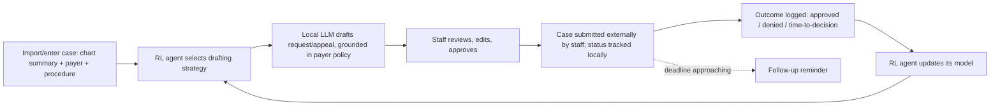
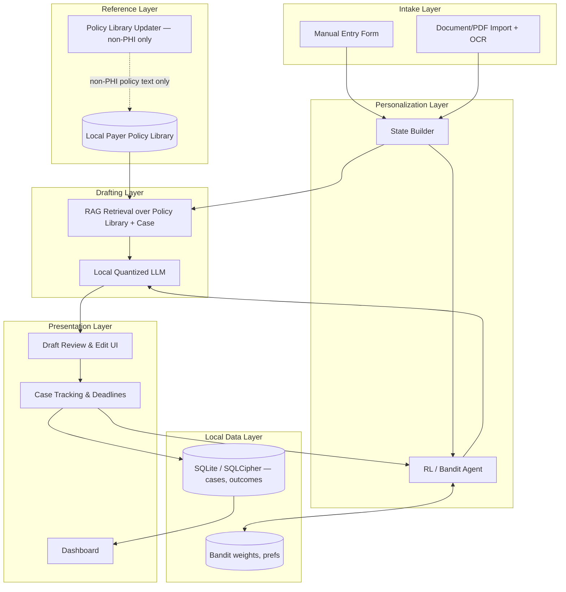
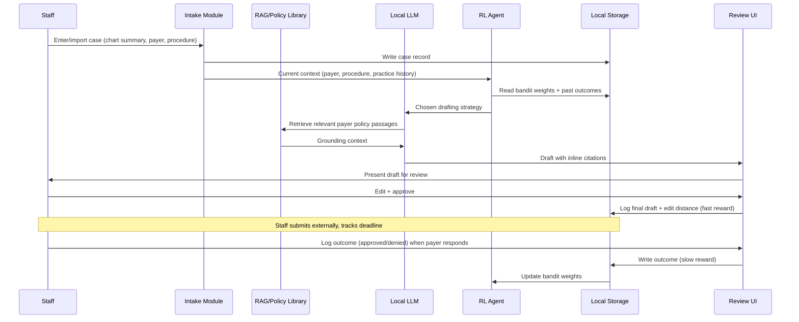

# Local Prior-Auth & Appeal Assistant — Project Specification

---

## 1. What This App Is Trying to Achieve

**The gap:** AI in prior authorization currently exists at two extremes, and small independent practices are served by neither. At one end, **Cohere Health** is the dominant player — but it's enterprise infrastructure sold to health plans (Humana, Geisinger, 500,000+ members each) and rolled out across large provider networks (3,500+ practices, 660,000+ clinicians). A solo dermatologist or a five-person physical therapy clinic has no realistic path to buying or integrating it. At the other end, tools like **Counterforce Health** and **Claimable** are patient-facing, cloud-hosted appeal-letter generators — useful for an individual fighting a denial after the fact, but not built as a tool clinic staff use every day, and not addressing the *initial* prior-authorization request, which is where most of a small practice's weekly administrative burden actually sits.

**The idea:** a desktop application, installed locally at the practice, that drafts prior-authorization requests and (if denied) appeal letters — grounded in the specific payer's published medical-necessity criteria — and gets better at it for *that specific practice's* payer mix over time via a lightweight RL/bandit agent. No patient chart, diagnosis, or case detail is ever transmitted off the machine it runs on. The project ships as open source specifically because, for a HIPAA-adjacent tool, "trust us" is a much weaker claim than "read the code and verify it yourself" — a practice's own IT or compliance contact (or any outside security researcher) can audit exactly what does and doesn't leave the machine, rather than taking a vendor's word for it.

**Mission statement:** give small practices the same prior-auth leverage that Cohere gives large payers and networks, without requiring the practice to trust a cloud vendor with patient data, sign a BAA, or pay enterprise pricing.

**Target user:** the office manager, biller, or clinical staff member at a small independent practice (roughly 1–20 providers) in a specialty with heavy prior-auth burden — dermatology, physical therapy, mental health/psychiatry, fertility, pain management, and specialty dental are the clearest fits. This person currently does this work by hand: copying old approved letters, guessing at current payer criteria, and tracking deadlines in a spreadsheet or their memory.

**Explicit non-goals:**
- This is a **decision-support drafting tool**, not a medical or legal advice product. It never diagnoses, never asserts medical necessity on its own authority, and every draft requires explicit human review and sign-off before it can be marked "ready to send." The app does not auto-submit to payers in v1.
- It does not claim to make a practice "HIPAA compliant" by itself — HIPAA compliance depends on the practice's whole environment (device security, staff training, physical access, etc.), not just this one tool. The honest claim is narrower and verifiable: *this software makes zero network calls containing patient data*, which anyone can confirm by reading the code or watching the network traffic.
- It is not an EHR replacement and does not attempt full EHR integration in v1 — that's a deliberate, explicit later-phase decision (see §8 and §9).

---

## 2. Core Product Loop

---

## 3. System Architecture Overview

Everything above the "Reference Layer" sync arrow runs entirely on the local machine. The **only** network call this application ever makes is fetching updated, publicly-published payer policy documents (medical-necessity criteria, which are not patient data). No case, chart, draft, or outcome data is ever transmitted — and because the project is open source, that claim is independently checkable, not just asserted.

---

## 4. Components, One by One

### 4.1 Case Intake & Document Import Module
**Purpose:** get a structured case record — patient's relevant clinical summary, procedure/service requested, payer and plan — into the system with minimal manual typing.

- Manual entry form for practices that prefer typing a brief clinical summary directly (deliberately supported as the baseline path — don't force document import as a hard dependency for v1).
- PDF/document import with OCR (for scanned chart notes, referral letters, or fax cover sheets) using a local OCR engine — no cloud OCR API.
- Explicit non-goal for v1: live EHR integration. This is the single most-requested feature bigger practices will ask for, and the single biggest scope trap — see §9.

### 4.2 Payer Policy Reference Library (RAG corpus)
**Purpose:** ground every draft in the actual, current medical-necessity criteria a payer has published for a given procedure — this is what separates a real prior-auth draft from a generic template.

- A local, versioned corpus of payer policy documents, organized by payer → plan type → procedure/specialty.
- Periodically refreshed via a narrow, documented sync process that downloads publicly available payer policy PDFs/pages — explicitly and only this, never case data, in either direction.
- Staleness is surfaced in the UI (e.g., "this payer's policy was last updated 47 days ago") so staff know when to double-check rather than trusting a possibly outdated citation.
- **Known hard part:** payer policies are inconsistent in format, change without clear notice, and vary by state and plan — building and maintaining this corpus, even just for a handful of specialties and major payers, is the highest-effort, highest-value part of the whole project, same role the labeled dataset played in a CV-model spec. Budget real time for this.

### 4.3 Local LLM Drafting Engine
**Purpose:** turn a case + retrieved policy criteria into a structured, citation-grounded draft letter.

- Quantized open-weight LLM (e.g., a Llama-, Gemma-, Phi-, or Mistral-class model in the 7–14B range — desktop hardware gives meaningfully more headroom than mobile, so this is a much less constrained choice than an on-device phone LLM would be) run locally via `llama.cpp` or `Ollama`.
- Retrieval-augmented generation over the case summary and the relevant payer policy excerpts — the point of RAG here isn't just quality, it's **auditability**: every claim in the draft should be traceable to a specific retrieved policy passage, which is also what makes the draft defensible to a payer reviewer.
- Output is always a *draft* — never presented as final or auto-sent.

### 4.4 RL Personalization Agent
**Purpose:** learn, per payer and per procedure type, which argument structure and citation emphasis actually gets approved fastest **for this specific practice's track record** — not a generic best practice, but this practice's own results.

- **Algorithm:** contextual bandit (LinUCB or Thompson Sampling), same reasoning as before — per-practice case volume is too low for deep RL to have anything to learn from, while a bandit converges on sparse data and stays fully interpretable, which matters a lot when staff will reasonably ask "why did it suggest this?"
- **State (context):** payer, plan type, procedure/specialty, and this practice's history of accepted/edited/rejected drafts and outcomes for that combination.
- **Action space:** kept small and discrete — e.g., "lead with clinical guideline citation," "lead with prior-treatment-failure history," "emphasize cost-effectiveness angle," "use payer's own stated criteria verbatim vs. paraphrase." A large action space kills bandit convergence on sparse per-practice data, same lesson as before.
- **Reward signal:**
  - Primary (fast, always available): did staff send the draft essentially as-is, or heavily rewrite it? Edit distance is a reasonable cheap proxy for draft quality.
  - Secondary (slow, ground truth): actual outcome — approved or denied — and time-to-decision, logged when staff close out the case. This is the signal that actually matters but arrives days to weeks later.
- **Cold start:** seed the bandit's prior directly from the payer's own published policy structure (if a payer's policy explicitly lists required criteria in a specific order, start there) rather than a blank prior — this mirrors the rule-based seeding pattern from other domains and matters more here because per-practice volume is genuinely low.
- **Honest limitation:** a small practice might only file a handful of prior auths a week. The bandit will learn slowly, and that should be stated plainly in the product rather than oversold — this is a tool that gets modestly smarter over months, not one that "learns fast."

### 4.5 Case Tracking & Deadline Management
**Purpose:** close the loop that's currently lost to memory and spreadsheets, and feed the RL agent's slow reward signal.

- Track submission date, payer-mandated response windows (these are often legally mandated and vary by state/payer/plan — worth building as configurable data, not hardcoded), and follow-up reminders.
- A simple "mark outcome" action (approved / denied / partial) when the payer responds — this single click is what makes the whole RL loop function, so it needs to be as low-friction as the "done/skip" swipe was in a consumer habit-loop app.

### 4.6 Review & Human-in-the-Loop Sign-off
**Purpose:** keep a human explicitly in control of anything that gets submitted to a payer, both for accuracy and for liability.

- Every draft opens in an editable review screen with the source citations visible inline (not just a wall of generated text) so staff can verify the reasoning, not just the output.
- A required explicit "approve" action before a case can be marked ready to send. No silent auto-submission in v1 — see §9 for why electronic submission integration is treated as a deliberate, separate, later decision rather than a default feature.

### 4.7 Local Data & Storage Layer
- Case records, drafts, and outcomes in an encrypted local database (SQLite with SQLCipher).
- Bandit weights and preferences in a lightweight local key-value store.
- No cloud backup by default — if/when you add optional backup, it needs its own explicit, separately-consented design (e.g., user-controlled encrypted export to a location *they* choose), not a default cloud sync.

### 4.8 Privacy, Security & Auditability Layer
- Hard architectural rule, enforced in code review and CI: no network call may ever include patient data. Automated tests should assert this (e.g., network-call allowlisting in CI, so a PR that adds an unreviewed outbound call fails the build).
- Local encryption at rest for the case database.
- A visible, one-click "export my data" and "delete all my data" control.
- Being open source is itself part of this layer, not just a licensing choice — a practice's IT contact, or any outside researcher, can read the networking code directly rather than trusting a privacy policy.

---

## 5. Tech Stack

| Layer | Choice | Notes |
|---|---|---|
| App framework | **Tauri** (Rust core + web frontend) or Electron | Tauri gives a much smaller bundle and better resource use for a desktop app bundling a local LLM runtime; Electron is the safer choice if the team's existing skills are JS/TS-heavy and want the more mature plugin ecosystem |
| Local LLM runtime | `llama.cpp` or Ollama (as a bundled local server) | Desktop hardware (even modest office PCs) gives far more headroom than mobile — 7–14B quantized models are realistic here in a way they weren't for a phone app |
| RAG / local vector store | `sqlite-vec`, LanceDB, or Chroma (local mode) | Keep it embedded/local, not a hosted vector DB |
| OCR | Tesseract (local) or a local vision model | For imported scanned documents/faxes |
| Local structured storage | SQLite + SQLCipher | Case history, outcomes, deadlines |
| Local key-value storage | A lightweight embedded KV store (e.g., `sled` if Rust, or similar) | Bandit weights, preferences |
| RL / personalization | Custom module (LinUCB / Thompson Sampling) | No external RL framework needed, same reasoning as before |
| State management | Framework-appropriate (Zustand/Redux if web-frontend-in-Tauri, or native state if fully native) | |
| Testing | Unit tests + integration tests for network-call auditing (assert zero PHI-bearing outbound calls) + offline replay tests for the bandit | The network-call audit test is worth treating as a first-class, always-run CI check given the trust claim it backs |
| CI/CD | GitHub Actions | Public CI runs reinforce the open-source trust story — anyone can see the test suite passing, including the privacy-audit tests |
| Distribution | GitHub Releases, signed binaries per OS | No app-store gatekeeping to navigate for a desktop tool, but code signing still matters for a healthcare-adjacent install |

---

## 6. App Design — Screens & Flow

1. **Dashboard** — pending cases, upcoming deadlines, this practice's approval-rate trend, quick "new case" action.
2. **New Case** — manual entry form or document import + OCR, payer/plan/procedure selection.
3. **Draft Review** — generated draft with inline citations back to specific payer policy passages, edit-in-place, "why this argument structure?" explanation (templated, referencing what's worked for this practice's payer history), approve action.
4. **Case Tracking** — status per case, submission date, response deadline countdown, follow-up reminders.
5. **Outcome Logging** — one-click mark approved/denied/partial when the payer responds; this is what feeds the RL agent's real signal, so it should be nearly frictionless.
6. **Policy Library** — browse the local payer-policy corpus per specialty/payer, see last-updated dates, manually trigger a refresh.
7. **Settings / Privacy** — data export, delete-all, and a visible **network activity log** — a literal list of exactly what was fetched and when (policy updates only), so trust isn't just a claim in the README, it's observable in the running app.

---

## 7. Data Flow (step by step)

---

## 8. Implementation Plan

| Phase | Scope | Notes |
|---|---|---|
| 0 — Foundations | Desktop app shell (Tauri/Electron), local encrypted DB, packaging/signing, CI with the network-call audit test wired in from day one | Get the "zero PHI network calls" guarantee enforced in CI before writing any drafting logic — it's the whole trust story, don't bolt it on later |
| 1 — Case intake | Manual entry form, basic case CRUD, local storage | Ship a usable "log a case" flow before the drafting engine exists |
| 2 — Policy library, single specialty/payer | Build and load one well-scoped payer-policy corpus (pick one payer + one specialty) | Deliberately narrow, same lesson as before — prove the full pipeline before expanding coverage |
| 3 — RAG + local LLM drafting | Wire retrieval + local LLM to produce a grounded draft for that one payer/specialty combo | Validate draft quality against real (anonymized/synthetic) past cases before expanding |
| 4 — Review UI + case tracking | Draft review/edit screen, deadline tracking, outcome logging | This is also what starts generating the data the bandit needs |
| 5 — RL agent v1 | LinUCB/Thompson Sampling wired to the single-payer drafting strategy choice | Validate with offline replay before trusting it live, same as before |
| 6 — Expand coverage | Add more payers/specialties, repeating the Phase 2–3 pipeline each time | |
| 7 — Document import + OCR | PDF/fax import for chart summaries | Reduces manual-entry friction, but deliberately not a Phase 0 dependency |
| 8 — Privacy hardening + open-source release prep | Security audit checklist, CONTRIBUTING.md, synthetic test fixtures (never real PHI in the repo, ever — see §9), public documentation of the network-call audit | This is the phase where "open source" actually becomes a credible trust asset rather than just a distribution choice |
| 9 — Stretch: e-submission integration | Optional direct submission to payer portals where APIs exist | Explicitly out of scope until the drafting/tracking loop is proven — this is where the human-in-the-loop guarantee gets hardest to preserve, treat it as a deliberate, separate decision |

*(No calendar estimates — actual timelines depend on team size, and the policy-library build-out in Phase 2 is the biggest real unknown, same role the dataset played in the original spec.)*

---

## 9. Risks & Mitigations

| Risk | Mitigation |
|---|---|
| LLM drafting hallucinates or misapplies policy criteria | RAG grounding with visible inline citations; mandatory human review before send; never auto-submit |
| Payer policy goes stale between syncs | Version and timestamp every policy document; surface staleness clearly in the UI |
| Sparse per-practice data → slow bandit learning | Rule-based cold start seeded from the payer's own published criteria; set honest expectations in-product about learning timelines |
| EHR integration expectations from larger practices | Explicitly scope v1 to manual entry/document import; treat EHR integration as a deliberate later decision, not a v1 blocker |
| Accidental PHI leakage in code, logs, or test fixtures | CI-enforced network-call audit test; hard rule of synthetic-only data in the public repo, ever — this is the one mistake that would be genuinely damaging for an open-source healthcare-adjacent project |
| Liability exposure from a bad draft | Frame consistently as decision support, never as medical/legal advice; require explicit human sign-off; disclaimers in-app and in documentation |
| Open-source support burden / no dedicated vendor | Be upfront in the README about the support model (community-driven vs. maintained) so practices adopt with accurate expectations |
| Redistributing a bundled LLM's model weights | Check the specific model's license for redistribution terms before bundling it in the public repo — not all open-weight models permit unrestricted redistribution |

---

## 10. Success Metrics

- Time spent per prior-auth case, before vs. after adoption (the core value claim — should be measurable and reportable back to the practice)
- Draft acceptance rate — how often staff send with minimal edits (proxy for drafting quality and for the RL agent's fast reward)
- Approval rate and time-to-approval, relative to the practice's own historical baseline (not a claimed industry benchmark — this practice's own before/after)
- Bandit performance over time — regret reduction / convergence per payer-procedure combination
- Missed-deadline rate (should trend toward zero — this is the "nothing falls through the cracks" value prop)
- Open-source health as its own metric: GitHub stars/forks are vanity, but issue response time, PR review time, and number of independent security reviewers who've looked at the network-call audit are the ones that actually matter for a trust-dependent tool

---

## 11. Licensing & Open-Source Considerations

- **License choice:** worth deciding deliberately rather than defaulting. MIT/Apache-2.0 maximizes adoption and lets any practice or vendor freely build on it. A copyleft license like AGPL is worth considering specifically *because* it would prevent a well-funded competitor from cloud-hosting a modified version as a paid SaaS without contributing changes back — which cuts against the local-only ethos this project is built around if someone tried to do exactly that. Neither is obviously correct; it's a real tradeoff to make consciously, not by default.
- **CONTRIBUTING.md and a security disclosure policy** should exist from the first public commit, given the healthcare-adjacent nature of the code, even though no PHI ever touches the repository itself.
- **Never commit real patient data**, even anonymized, to test fixtures — use synthetic cases generated for testing. This is worth stating as a hard, enforced rule (e.g., a pre-commit hook scanning for PHI-shaped patterns) rather than a norm people are trusted to remember.
- **Governance:** decide early whether this stays a single-maintainer project or is structured for outside contributors from the start — the policy-library maintenance work in particular (§4.2, §8 Phase 2/6) is exactly the kind of ongoing, specialty-by-specialty grind that benefits from community contribution if the project gains traction.

---

## 12. UK Market Consideration

Everything from §1 onward is implicitly US-shaped — "prior authorization" as a concept assumes a fee-for-service, itemized private-insurance system where a payer's own published medical-necessity criteria gate coverage of an otherwise-fundable service. The UK's NHS is structured completely differently (near-universal public funding, not itemized insurance), so "the same product, UK-flavored" is not a safe assumption to build on. Confirmed by real research below, not asserted from general knowledge, given how wrong an assumption here could steer real engineering time.

**Two distinct UK analogs exist — not one blended feature:**

1. **UK private medical insurance (BUPA, AXA Health, Vitality, Aviva, WPA, and similar).** Confirmed: pre-authorisation is mandatory for nearly all treatment with both BUPA and AXA Health specifically — a private insurer's own criteria gate a specific claim, essentially the same shape as the US model this whole spec already describes. This is the closest 1:1 fit to the existing design: same core product loop (§2), same "payer policy corpus → grounded draft → human review" architecture (§3, §4.2–§4.6), just a different set of payers to run the existing Phase 6 "expand coverage" pipeline (§8) against.

2. **NHS Individual Funding Requests (IFRs).** The closest NHS-side analog, but a genuinely different reasoning task, not a reskin of the same one. Confirmed (current through 2026, via each region's Integrated Care Board — ICBs — with a related "Prior Approval" system being retired 31 March 2026 in favor of electronic IFR forms): an IFR exists for treatment **not routinely commissioned** by a patient's ICB, and is argued on **clinical exceptionality** — the case must be shown to be exceptional relative to the general population of patients with the same condition, not simply shown to meet a payer's published inclusion criteria the way US prior-auth and UK private pre-auth both work. Consequences for this spec's design if IFR support is ever built:
   - **The "policy corpus" concept (§4.2) doesn't map directly.** There's no single published "medical necessity criteria" document to cite the way Aetna's or Cigna's clinical policy bulletins work — each ICB publishes its own commissioning policies (what's routinely funded), and an IFR argues the *absence* of routine funding should be overridden, not that inclusion criteria are met.
   - **The drafting prompt (§4.3) would need real rework, not reuse.** The existing design grounds every claim in a payer's own excerpt and argues the case matches it. An IFR needs the opposite rhetorical structure: "here's why this patient is different from the population this policy was written for," not "here's how this patient matches the policy."
   - **Who drafts it also needs reconfirming.** IFRs can only be submitted by the treating clinician, not the patient — broadly consistent with this spec's target-user framing (§1, clinical/office staff), but worth confirming in practice whether admin staff draft on the clinician's behalf (matching how this tool already imagines the office-manager workflow) or whether it's typically the clinician directly.

**Recommendation, not yet decided:** the UK private-insurer track (BUPA/AXA/Vitality/etc.) is the natural first UK expansion — it slots into the existing architecture and the Phase 6 pipeline with no fundamental redesign, the same way adding a second US payer does. NHS IFR support is real and potentially valuable, but is its own deliberate design phase (new prompt structure, a "corpus" sourced from ICB commissioning policies rather than a single payer-published criteria document) — not something that falls out of the existing pipeline for free, and not scoped further than this here.

**Compliance terminology shifts, and the architecture holds up well under the new terms — a reassuring finding, not a new risk.** HIPAA doesn't apply in the UK; the relevant framework is UK GDPR plus the Data Protection Act 2018, and the US-specific term "PHI" has no direct UK equivalent (closer terms: "special category data" under UK GDPR, or the NHS's own "patient identifiable data" / "confidential patient information"). The core architectural promise this whole project is built around — zero patient data ever leaves the machine (§1, §3, §4.8) — holds up at least as well, arguably more compellingly, under UK GDPR's data-residency and processing rules as it does under HIPAA. The local-first architecture doesn't need to change for a UK pivot; only the terminology used to describe why it matters does, and eventually the specific legal claims made in documentation.

**Explicitly not yet decided — needs the same real research discipline every payer/market decision in this project has followed, not assumption:**
- Which UK private insurer to target first for the Phase 6 pipeline (BUPA and AXA Health both confirmed to require pre-auth; each needs its own "which specific document, is it text-extractable, what's the licensing" diligence, the same way Phase 6 already applies that check to Cigna rather than assuming it transfers from Aetna).
- Whether to prioritize the UK private-insurer track over further US payer expansion, or run both — a product-strategy call, not a technical one, and not decided here.
- Full scoping of an NHS IFR product surface, if it's pursued at all — deserves its own spec-level design pass, not the paragraph above.
